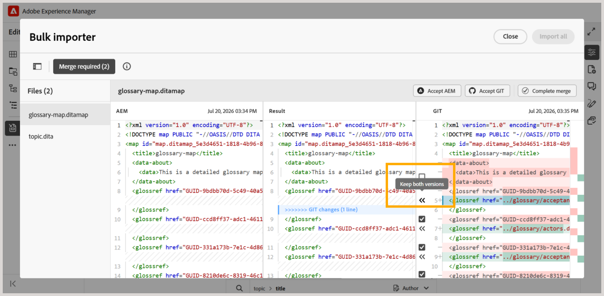

# Importa contenuto utilizzando il connettore Git

>[!NOTE]
>
> Questa funzione è disabilitata per impostazione predefinita. Per abilitarlo nel tuo ambiente, contatta il team Customer Success.

Il connettore Git consente di [importare contenuto dagli archivi Git connessi in Experience Manager Guides](#import-content-from-the-connected-git-repository). Dopo l’importazione dei contenuti, puoi utilizzare le funzioni di authoring, revisione, traduzione e pubblicazione di Experience Manager Guides per sviluppare e distribuire la documentazione.

Quando il contenuto cambia nell’archivio di origine, puoi recuperare gli aggiornamenti, esaminare i conflitti e sincronizzare le modifiche più recenti con Experience Manager Guides.

## Funzioni principali

Il connettore Git consente agli autori di estrarre il contenuto direttamente da un archivio Git in Experience Manager Guides, senza trasferimenti di file manuali. Una volta configurata, gli autori possono accedere alle seguenti funzionalità.

**Acquisizione dei contenuti**

- Sincronizza i file da qualsiasi archivio Git (pubblico o privato) in Experience Manager Guides.
- Filtra per percorso della cartella di origine per acquisire una singola sottodirectory invece di un intero archivio.
- Utilizza un motore di regole `gitignore-aware` per ignorare automaticamente i file esclusi da `.gitignore` pattern o regole personalizzate.
- Mantiene i GUID durante la risincronizzazione per mantenere intatti i rimandi DITA esistenti dopo un aggiornamento.

**Sincronizzazione incrementale (delta)**

- Tiene traccia dell’ultimo commit sincronizzato e recupera solo i file aggiunti, modificati o eliminati nelle sincronizzazioni successive, anziché reimportare l’intero archivio.
- Genera un report delta che elenca tutti i file modificati e il relativo tipo di modifica prima dell&#39;importazione.
- Mantiene tempi di recupero coerenti indipendentemente dalle dimensioni dell’archivio. Per i dati del benchmark, visualizzare [Benchmark delle prestazioni](#performance-benchmarks).

## Funzionamento del connettore Git

Il diagramma seguente mostra come il connettore Git sposta il contenuto da un archivio di origine a Experience Manager Guides.

Il connettore Git sposta il contenuto da un archivio Git a Experience Manager Guides in quattro fasi:

1. **Scansiona e sincronizza**: un crawler si connette all&#39;archivio Git e al profilo Git configurati e sincronizza il contenuto nel connettore su richiesta.
1. **Acquisire e rilevare i conflitti**: i file in arrivo vengono analizzati e sottoposti a hashing rispetto a quelli già presenti in Experience Manager Guides. I file senza modifiche in conflitto vengono spostati automaticamente; i file con modifiche in conflitto vengono contrassegnati per la risoluzione manuale.
1. **Persist**: il contenuto risolto viene elaborato e salvato in AEM, insieme agli altri contenuti Experience Manager Guides.
1. **Flusso di lavoro di Experience Manager Guides**: una volta mantenuto, il contenuto è disponibile come qualsiasi altro contenuto di Experience Manager Guides per l&#39;authoring, la revisione, la traduzione e la pubblicazione.

## Benchmark delle prestazioni

I seguenti benchmark mostrano tempi di sincronizzazione completi (non incrementali) di **Importazione in blocco** su Experience Manager as a Cloud Service, a una scalabilità crescente dell&#39;archivio.

| Scala | Tempo di recupero | Tempo di importazione | Tempo totale | Batch | Velocità effettiva |
|---|---|---|---|---|---|
| 1.000 file | 1 m 53 s | 3 m 30 s | 5 m 29 s | 10 × 100 | ~286 file/min |
| 5.000 file | 1 m 55 s | 18 m 21 s | 20 m 27 s | 20 × 250 | ~273 file/min |
| 10.000 file | 1 m 39 s | 36 m 22 s | 37 m 24 s | 40 × 250 | ~267 file/min |
| 50.000 file | 1 m 25 s | 2h 43 m | 2h 58 m | 200 × 250 | ~270 file/min |

## Importare contenuti con il connettore Git

Dopo che l’amministratore ha configurato il connettore Git in Experience Manager Guides, puoi utilizzarlo dall’editor per importare contenuti da un archivio Git.

## Prerequisiti

Prima di iniziare a utilizzare questa funzione, assicurati che:

- La funzione del connettore Git deve essere abilitata per il tuo ambiente.
- (*Se abilitato*) L&#39;amministratore ha configurato il connettore Git nell&#39;ambiente. Per ulteriori dettagli, visualizzare [Creare e configurare il connettore Git dall&#39;interfaccia utente](../install-conf-guide/conf-git-connector.md).
- Hai accesso in *lettura* all&#39;archivio Git che contiene il contenuto da importare.
- Si conosce il ramo del repository e la cartella di origine che si desidera importare.
- Conosci la cartella di destinazione in Experience Manager Guides in cui verrà memorizzato il contenuto importato.

## Importa contenuto dall’archivio Git connesso

Per importare il contenuto da un archivio Git, effettua le seguenti operazioni:

1. Nell’editor, apri il pannello a sinistra.
1. Selezionare **Origini dati**.

   Vengono visualizzate le origini dati collegate.

1. Selezionare il riquadro **Connettore Git**.

1. Seleziona l&#39;icona +, quindi seleziona **Importazione in blocco**.

   Viene visualizzata la finestra di dialogo **Importazione in blocco**.

   

1. Nella finestra di dialogo **Importazione in blocco**, specifica un nome per l&#39;importazione, seleziona una sottocartella dall&#39;archivio Git configurato e seleziona **Salva e recupera**.  L’elenco dei file disponibili per l’importazione viene visualizzato nella finestra di dialogo. Rivedi l’elenco e convalida il contenuto prima di continuare.

   

1. Dopo aver esaminato i file, selezionare **Importa tutto** per importare il contenuto in Experience Manager Guides.

   >[!NOTE]
   >
   > Puoi abilitare **Sincronizzazione automatica** per sincronizzare e importare automaticamente il contenuto dall&#39;archivio Git in Experience Manager Guides. Se vengono rilevati errori, la sincronizzazione automatica non viene attivata e l&#39;autore deve importare manualmente il contenuto selezionando **Importa tutto**. Una volta abilitata, la sincronizzazione automatica non può essere disabilitata per l’importazione.

Una volta importato, il contenuto viene archiviato nel percorso radice **Target AEM** configurato durante la configurazione del connettore Git.

## Gestire i contenuti importati da Git

Una volta importato il contenuto in Experience Manager Guides, puoi utilizzare le azioni disponibili per gestirlo e mantenerlo sincronizzato con le modifiche nell’archivio sorgente.

{width="600"}

- **Anteprima**: contenuto importato in anteprima. Se l&#39;archivio di origine contiene aggiornamenti, esaminare le differenze e utilizzare l&#39;opzione **Recupera di nuovo** per importare le modifiche più recenti. Se le differenze richiedono l&#39;unione, visualizzare [Risoluzione dei conflitti del connettore Git](#review-and-resolve-content-conflicts).
- **Elimina**: rimuovi l&#39;importazione non più necessaria.
- **Rinomina**: rinomina l&#39;importazione per facilitarne l&#39;identificazione.
- **Visualizza log**: visualizza il log di importazione per esaminare i dettagli dell&#39;operazione di importazione.
- **Visualizza report**: visualizza e scarica il **report di importazione in blocco**, che include dettagli quali:

  - numero totale di file importati
  - numero di importazioni riuscite
  - numero di importazioni non riuscite

  {width="600"}

  Puoi anche scaricare il rapporto dettagliato. Se alcuni file non vengono importati, utilizzare **Riprova importazioni non riuscite** per provare di nuovo a importarli.

## Rivedere e risolvere i conflitti di contenuto

Quando recuperi nuovamente il contenuto da un archivio Git, vengono visualizzate come conflitti le differenze di contenuto tra la versione dell’archivio e il contenuto corrispondente disponibile in Experience Manager Guides. È necessario risolvere e unire tali conflitti prima di importare i dati in Experience Manager Guides.

Per risolvere e unire i conflitti, effettuare le seguenti operazioni:

1. Apri la finestra di dialogo Importazione in blocco e seleziona **Recupera di nuovo**.
1. Se vengono rilevati conflitti, viene visualizzata la scheda **Unisci richiesto** in cui sono elencati i file che contengono conflitti. Selezionare la scheda **Unione richiesta**, quindi selezionare un file dall&#39;elenco per esaminare e risolvere i conflitti.
1. Per i file con conflitti, viene visualizzata una visualizzazione unione a tre vie.

   

   Nel riquadro di sinistra (**AEM**) viene visualizzato il contenuto corrente dall&#39;archivio AEM, mentre nel riquadro di destra (**GIT**) viene visualizzato il contenuto in ingresso dall&#39;archivio Git remoto. Il riquadro centrale (**Risultato**) è inizialmente popolato con il contenuto dell&#39;archivio AEM e funge da editor di unione, dove vengono risolti i conflitti. Il risultato finale dell&#39;unione viene prodotto e visualizzato in questo riquadro centrale.

1. Esamina le differenze evidenziate nell’editor e risolvi i conflitti utilizzando i controlli di unione:

   - Se desideri utilizzare le modifiche più recenti dall&#39;archivio Git, accertati che sia selezionata la casella di controllo per il conflitto nella sezione **GIT**, quindi seleziona il controllo `<<<` corrispondente. Il contenuto Git selezionato sostituisce il contenuto in conflitto nella sezione **Risultato**.

     

   - Se si desidera mantenere il contenuto di entrambe le versioni, deselezionare la casella di controllo relativa al conflitto e quindi utilizzare il controllo `<<<` per aggiungere il contenuto richiesto alla sezione **Risultato** senza sostituire il contenuto esistente.

     

   - Analogamente, è possibile utilizzare il controllo `>>>` nella sezione AEM per mantenere la versione attualmente disponibile in Experience Manager Guides.

1. Dopo aver esaminato il contenuto unito, eseguire una delle operazioni seguenti:

   - Utilizza **Accetta AEM** per sostituire completamente il contenuto della sezione **Risultato** con la versione della sezione **AEM**, mantenendo le modifiche locali.
   - Utilizza **Accetta GIT** per sostituire completamente il contenuto della sezione **Risultato** con la versione della sezione **GIT**, mantenendo le modifiche dell&#39;archivio.

**È necessario completare l&#39;unione**, indipendentemente dall&#39;opzione utilizzata in precedenza. Selezionando questa opzione, il contenuto corrente di **Risultato** viene bloccato come versione risolta del file e il file viene contrassegnato come unito.

Dopo aver contrassegnato come uniti tutti i file contenenti i conflitti, il pulsante **Importa tutti** è attivato. Seleziona **Importa tutto** per completare il processo di risoluzione dei conflitti.

Se un file è stato modificato nell’archivio Git ma non in Experience Manager Guides, non è richiesta alcuna unione. Tali file vengono inclusi automaticamente in **Aggiornamenti puliti** e possono essere importati direttamente.

{width="600"}