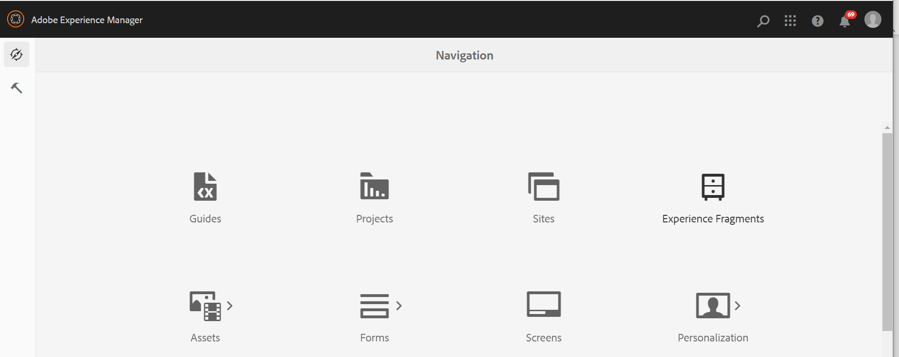

# Avviare l’editor {#id2056B0140HS}

Puoi avviare l’Editor dalle seguenti posizioni:

- [Pagina di navigazione Adobe Experience Manager](#adobe-experience-manager-navigation-page)
- [Interfaccia utente di Adobe Experience Manager Assets](#adobe-experience-manager-assets-ui)
- [Console mappe](#map-console)

Le sezioni seguenti descrivono come accedere e avviare l’Editor da varie posizioni.

## Pagina di navigazione Adobe Experience Manager

Quando accedi ad Experience Manager, viene visualizzata la pagina Navigazione:

{align="left"}

Se si seleziona il collegamento **Guide**, verrà visualizzata la [home page di Adobe Experience Manager Guides](./intro-home-page.md).

{align="left"}

Per avviare l&#39;editor, passare alla barra di navigazione e selezionare **Editor** dal menu a discesa. La home page è selezionata per impostazione predefinita.

{width="350" align="left"}

Dopo aver avviato l&#39;editor senza selezionare alcun file, viene visualizzata una schermata dell&#39;editor vuota. Puoi aprire un file per la modifica da Experience Manager **Archivio** o dalle tue **Raccolte**.

{align="left"}

In alternativa, è possibile avviare l&#39;editor aprendo i file esistenti presenti nel widget **File recenti** e nel widget **Raccolte** della [esperienza pagina iniziale di Adobe Experience Manager Guides](./intro-home-page.md).

Per tornare alla pagina di navigazione di Experience Manager, seleziona il logo Adobe Experience Manager che si trova nell’angolo in alto a sinistra dell’intestazione superiore.

## Interfaccia utente di Adobe Experience Manager Assets

Un’altra posizione da cui è possibile avviare l’editor è quella dell’interfaccia utente di Experience Manager Assets. Puoi selezionare uno o più argomenti e aprirli direttamente nell’editor.

Per aprire un argomento nell&#39;editor, eseguire la procedura seguente:

1. Nell’interfaccia utente di Assets, individua l’argomento da modificare.

   >[!NOTE]
   >
   > Puoi anche visualizzare l’UUID dell’argomento.

   {align="left"}

   >[!IMPORTANT]
   >
   > Verificare di disporre delle autorizzazioni di lettura e scrittura per la cartella contenente l&#39;argomento che si desidera modificare.

1. Per ottenere un blocco esclusivo sull&#39;argomento, selezionare l&#39;argomento e selezionare **Estrai**.

   >[!IMPORTANT]
   >
   > Se l&#39;amministratore ha configurato l&#39;opzione **Disattiva modifica senza bloccare il file**, è necessario estrarre il file prima di modificarlo. Se il file non viene estratto, non sarà possibile visualizzare l&#39;opzione di modifica.

1. Chiudi la modalità di selezione delle risorse e seleziona l’argomento da modificare.

   Viene visualizzata l&#39;anteprima dell&#39;argomento.

   È possibile aprire l&#39;editor dalla vista Elenco, dalla vista Scheda e dalla modalità Anteprima.

   >[!IMPORTANT]
   >
   > Se desideri aprire più argomenti per la modifica, seleziona gli argomenti desiderati dall&#39;interfaccia utente di Asset e seleziona **Modifica**. Assicurati che nel browser non sia abilitato il blocco dei popup, altrimenti verrà aperto per la modifica solo il primo argomento dell’elenco selezionato.

   {align="left"}

   Se non vuoi visualizzare l&#39;anteprima di un argomento e vuoi aprirlo direttamente nell&#39;editor, seleziona l&#39;icona **Modifica** nel menu Azioni rapide dalla vista a schede:

   {align="left"}

   L’argomento viene aperto nell’editor.

   {align="left"}

Puoi anche aprire un file di mappa nell’interfaccia utente di Assets e avviare l’Editor per modificare gli argomenti nel file di mappa.

Per aprire una mappa nell’editor, effettua le seguenti operazioni:

1. Nell’interfaccia utente di Assets, individua e seleziona il file di mappa contenente l’argomento da modificare.
1. Nella console Mappa DITA, passa alla scheda **Argomenti**. Viene visualizzato un elenco di argomenti nel file mappa.
1. Selezionare il file dell&#39;argomento che si desidera modificare.
1. Selezionare **Modifica argomento**.

   {align="left"}

1. L’argomento viene aperto nell’editor.

   >[!IMPORTANT]
   >
   > Se l&#39;amministratore ha configurato l&#39;opzione **Disattiva modifica senza bloccare il file**, è necessario estrarre il file prima di modificarlo. Se non si estrae il file, il documento viene aperto nell&#39;editor in modalità di sola lettura.

## Console mappe

Per aprire l’editor dalla console Mappa, effettua le seguenti operazioni:

1. Apri la pagina Home e avvia la console Mappa.

   {width="350" align="left"}

   Quando hai avviato la console Mappa senza selezionare alcun file di mappa, viene visualizzata una schermata vuota della console Mappa. Puoi anche aprire un file mappa da Experience Manager **Repository** o dalle tue **Raccolte**.

   {width="500" align="left"}

1. Scegliere **Seleziona mappa** per aprire un file di mappa contenente gli argomenti che si desidera modificare nell&#39;editor.
1. Selezionare il percorso in cui si trova il file mappa. Il file di mappa selezionato viene aggiunto alla console Mappa.
1. Passa al file di mappa e seleziona **Apri nell&#39;editor** dal menu a discesa.

   {align="left"}

   Il file di mappa contenente gli argomenti è aperto per la modifica nell&#39;editor.

   {align="left"}

**Argomento padre**: [Introduzione all&#39;editor](web-editor.md)
