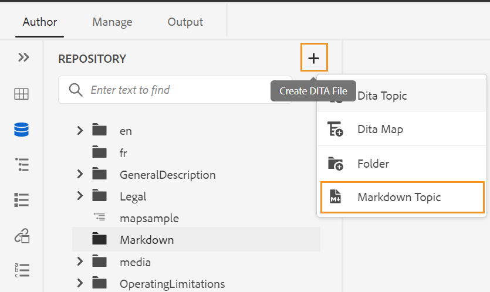

# Creare documenti Markdown dall’editor web {#id223MIE0B079}

Markdown è un linguaggio di markup leggero che consente di aggiungere elementi di formattazione ai documenti di testo normale. Le guide AEM consentono di creare, creare e visualizzare in anteprima un argomento Markdown \(.md\) dall’editor Web. Puoi anche caricare i documenti Markdown esistenti e modificarli nell’Editor web.

## Creare un argomento Markdown

Per creare un argomento Markdown dall’editor Web, effettua le seguenti operazioni:

1. Selezionare una cartella nella vista Archivio.
1. Crea **Argomento Markdown** in uno dei seguenti modi:
   1. Clic **Crea file DITA** nell’angolo in alto a destra del pannello Archivio, quindi seleziona **Argomento Markdown** dal menu a discesa.

   {width="550" align="left"}

   1. Seleziona **Crea** dal menu Opzioni della cartella selezionata, quindi selezionare **Argomento Markdown** dal menu a discesa.

   {width="550" align="left"}

1. Immetti il nome e il percorso dell&#39;argomento Markdown nel **Crea nuovo argomento Markdown** .

{width="350" align="left"}

1. Fai clic su **Crea**.

L&#39;argomento Markdown viene creato nel percorso selezionato e può essere modificato.

## Creare e visualizzare in anteprima un argomento Markdown

Per creare un argomento Markdown dall’editor Web, effettua le seguenti operazioni:

1. Seleziona un argomento Markdown esistente\(.md\) nella Vista archivio.
1. Fare doppio clic sull&#39;argomento per aprirlo nella finestra di modifica.

   L’argomento viene aperto in modalità Sorgente.

1. Aggiorna il contenuto nell’argomento Markdown.
1. Clic **Anteprima** in alto a destra per visualizzare l’anteprima dell’argomento.

   >[!NOTE]
   >
   > La modalità Anteprima mostra come verrà visualizzato un argomento quando viene visualizzato da un utente nel browser.

1. Utilizzare **Salva come nuova versione** nella barra degli strumenti principale per salvare le modifiche apportate all&#39;argomento e creare una nuova versione dell&#39;argomento. Puoi anche utilizzare **Salva tutto** nella barra degli strumenti principale per salvare le modifiche in tutti gli argomenti aperti.

1. Clic **Chiudi** in alto a destra per chiudere l&#39;argomento Markdown.

>[!NOTE]
>
> Se le modifiche non sono state salvate, viene visualizzata una finestra a comparsa e viene richiesto di salvare l&#39;argomento prima di chiuderlo.

**Argomento padre:**[ Utilizzare l’editor web](web-editor.md)
