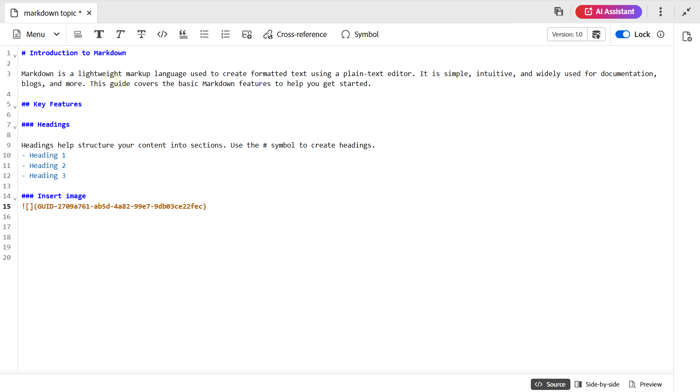

# Creare documenti Markdown dall’Editor {#id223MIE0B079}

Markdown è un linguaggio di markup leggero che consente di aggiungere elementi di formattazione ai documenti di testo normale. Adobe Experience Manager Guides offre la funzione di creare, creare e visualizzare in anteprima un argomento Markdown \(.md\) dall’Editor. Puoi anche caricare i documenti Markdown esistenti e modificarli nell’Editor.

## Creare un argomento Markdown

Per creare un argomento Markdown dall’editor, effettua le seguenti operazioni:

1. Nel pannello Archivio selezionare , quindi **Argomento** dal menu a discesa.
1. Nella finestra di dialogo **Nuovo argomento**, fornisci i seguenti dettagli:

   {width="300" align="left"}

   * **Titolo**: specifica un titolo per l&#39;argomento.
   * **Nome**: il nome del file viene suggerito automaticamente in base al Titolo dell&#39;argomento. Se l’amministratore ha abilitato i nomi di file automatici in base all’impostazione UUID, il campo Nome non verrà visualizzato.
   * **Modello**: selezionare **Markdown** dall&#39;elenco a discesa. Il modello **Argomento** è selezionato per impostazione predefinita.
   * **Percorso**: sfogliare il percorso in cui si desidera salvare il file dell&#39;argomento. Per impostazione predefinita, il percorso della cartella attualmente selezionata nell’archivio viene visualizzato nel campo Percorso.

   >[!NOTE]
   >
   > In caso di aggiornamento, devi aggiungere il modello Markdown al profilo della cartella corrente in uso. È possibile [creare un nuovo modello di markdown dall&#39;editor](./web-editor-features.md#templates) o utilizzare un modello esistente per la creazione di markdown. Per informazioni dettagliate su come aggiungere modelli di authoring in Experience Manager Guides, visualizzare [Configurare profili globali o a livello di cartella](../cs-install-guide/conf-folder-level.md).
1. Seleziona **Crea**.

   L&#39;argomento Markdown viene creato nel percorso selezionato e può essere modificato.

   {width="650" align="left"}

>[!NOTE]
>
> È inoltre possibile creare un argomento markdown per una cartella all’interno del pannello Archivio. Selezionare la cartella in cui si desidera creare un argomento Markdown e selezionare **Nuovo**, quindi selezionare **Argomento** dal menu Opzioni. È ora possibile creare un argomento Markdown fornendo i dettagli dell&#39;argomento nella finestra di dialogo **Crea argomento**.

## Conoscere le funzioni dell’editor per un argomento Markdown

Questa sezione descrive le varie funzioni disponibili nell’Editor per la creazione di argomenti in Markdown. L’interfaccia di authoring è divisa nelle sezioni o aree seguenti:

* [Barra degli strumenti](#toolbar)
* [Area di modifica dei contenuti](#content-editing-area)
* [Modalità Source, Side-by-Side e Preview](#source-side-by-side-and-preview-modes)
* [Pannello a destra](#right-panel)

<!--
### Tab bar 

The tab bar features the file tabs of the topics or maps that are currently opened in the Editor along with other file-level options. 

Features available in the tab bar are explained as follows:

 {width="550" align="left"}

* **Topic tab**: Displays the currently opened topics in a tab. By default, you can view the file titles in the tab. As you hover over a file, you can view the file title and the file path as a tooltip.

    >[!NOTE]
    >
    > As an administrator, you can also choose to view the list of files by filenames in the tabs. View [User preferences](./intro-home-page.md#user-preferences) for details.
* **Save all**: Saves the changes you have made in all opened topics. If you have multiple topics opened in the Editor, selecting **Save all** or pressing `Crtl+S` shortcut keys saves all documents in one click. You do not have to individually save each document.
* **AI Assistant**: [AI-powered Smart Help](./ai-based-smart-help.md) feature that helps you find relevant content from the Adobe Experience Manager Guides Documentation.
* **More actions**: Allows you to navigate to the **Assets UI**. As an administrator, you also get an option to navigate to the **Settings** page. Learn how to work with [settings](./web-editor-features.md#main-toolbar) or editor settings. 
* **Expand view**: Allows you to expand the page view using the **Expand** icon. In this view, the header bar is hidden, maximizing the content space. To return to the standard view, use the **Exit the expanded view** icon.

-->

### Barra degli strumenti

La barra degli strumenti si trova appena sotto la barra delle schede. Le funzioni disponibili nella barra degli strumenti sono illustrate come segue:

{align="left"}

| Funzioni | Descrizione |
|----------------|----------------|
| Modifica delle azioni | Consente di accedere a varie funzionalità di modifica dei documenti, tra cui **Taglia**  , **Annulla**  , **Ripeti**  , **Copia**  , **Elimina**   e **Trova e sostituisci**  . Puoi accedere alle opzioni disponibili dal menu a discesa **Menu**. |
| Opzioni di formattazione del testo | Consente di accedere a varie opzioni di formattazione del testo, tra cui **Intestazioni**  , **Grassetto**  , **Corsivo**  , **Barrato**  , **Codice**   e **Citazione di blocco**  . |
| Opzioni di inserimento contenuti | Fornisce le opzioni per inserire un **elenco numerato**  , **Elenco ordinato**  , **Tabella**  , **Immagine** , **Riferimento incrociato**   e **Simbolo**   in un documento.   **Nota**: puoi anche trascinare immagini e altri file nell&#39;editor Markdown. I file vengono aggiunti come collegamenti di riferimento incrociato, mentre le immagini vengono visualizzate come elementi immagine standard. |
| Cronologia delle versioni | Consente di creare versioni dei file Markdown e di visualizzare la cronologia delle modifiche. Puoi confrontare versioni diverse e, se necessario, ripristinare quelle precedenti. L&#39;opzione Cronologia versioni è presente nel menu a discesa **Menu**. |
| Salva come nuova versione | Salva le modifiche apportate nell&#39;argomento e crea anche una nuova versione dell&#39;argomento. Se si sta lavorando su un argomento appena creato, le informazioni sulla versione vengono visualizzate come nessuna. |
| Blocca/sblocca | Blocca o sblocca il file corrente. Il blocco di un file consente di accedere in scrittura in modo esclusivo al file. Questo impedisce ad altri utenti di modificare il file. Sblocca il file se vuoi che altri utenti abbiano accesso in modifica. In qualità di amministratore, puoi anche accedere alla funzionalità **Forza sblocco** che ti consente di sbloccare il file bloccato da un altro utente. |

>[!NOTE]
>
> La funzionalità **Cronologia versioni** e le funzionalità menzionate in azioni di modifica, formattazione del testo e inserimento del contenuto sono accessibili da entrambe le visualizzazioni **Source** e **Affiancate** dell&#39;argomento Markdown.

### Area di modifica dei contenuti

Nell&#39;area di modifica del contenuto viene visualizzata l&#39;origine Markdown dell&#39;argomento, in cui è possibile apportare tutte le modifiche al contenuto. Nella visualizzazione affiancata, quest&#39;area si divide in due sezioni: la visualizzazione origine Markdown a sinistra e la visualizzazione Anteprima a destra. È possibile aprire più argomenti contemporaneamente, che vengono visualizzati nelle rispettive schede.

### Modalità Source, Side-by-Side e Preview

Per l’authoring Markdown, l’editor supporta tre diverse modalità di visualizzazione per agevolare la creazione e la formattazione dei contenuti:

{align="left"}

* Origine
* Affiancato
* Anteprima

**Origine**

Questa è la visualizzazione del codice markdown dell’editor. È possibile modificare gli argomenti di markdown come si fa in qualsiasi normale editor di markdown. Nella visualizzazione Source è possibile salvare una revisione del documento, inserire intestazioni, inserire tabelle, inserire immagini e altro ancora.

Utilizzare questa visualizzazione se si desidera concentrarsi esclusivamente sulla scrittura e sulla modifica del markdown non elaborato senza visualizzare l&#39;output di cui è stato eseguito il rendering.

**Affiancati**

Questa modalità suddivide l’Editor in due pannelli:

* Pannello Source che visualizza l’argomento Markdown che stai modificando.
* Pannello Anteprima che mostra in tempo reale l’output di rendering dell’argomento Markdown.

{width="550" align="left"}

Utilizzare questa visualizzazione se si desidera visualizzare l&#39;output di cui è stato eseguito il rendering in tempo reale durante la modifica degli argomenti di markdown.

**Anteprima**

Quando si apre un argomento Markdown in modalità Anteprima, viene mostrato come verrà visualizzato un argomento quando viene visualizzato da un utente nel browser. In questa vista, tutte le funzioni di modifica vengono rimosse dalla barra degli strumenti. È comunque possibile accedere alle funzionalità **Salva come nuova versione**, **Blocca/sblocca** nella barra degli strumenti e alla funzionalità **Proprietà file** nel pannello di destra.

### Pannello a destra

Il pannello a destra consente di accedere al pannello **Proprietà file&quot;.

Le proprietà del file sono suddivise nelle due sezioni seguenti:

**Generale**

La sezione Generale consente di accedere alle seguenti funzioni:

* **Nome file**: visualizza il nome del file dell&#39;argomento selezionato.
* **ID**: visualizza l&#39;ID dell&#39;argomento selezionato.
* **Lingua**: mostra la lingua dell&#39;argomento. Viene impostato dal campo della lingua nella pagina delle proprietà.
* **Data creazione**: visualizza la data e l&#39;ora di creazione dell&#39;argomento.
* **Modificato il**: visualizza la data e l&#39;ora di modifica dell&#39;argomento.
* **Bloccato da**: mostra l&#39;utente che ha estratto l&#39;argomento.
* **Stato documento**: è possibile selezionare e aggiornare lo stato del documento dell&#39;argomento attualmente aperto. Per ulteriori dettagli, visualizzare [Stato documento](./web-editor-document-states.md).
* **Tag**: questi sono i tag di metadati dell&#39;argomento. Vengono impostati dal campo tag della pagina delle proprietà. Puoi digitarli o selezionarli dal menu a discesa. I tag vengono visualizzati sotto il menu a discesa. Per eliminare un tag, seleziona l’icona a forma di croce accanto al tag.
* **Modifica altre proprietà**: è possibile modificare altre proprietà dalla pagina delle proprietà del file.

**Riferimenti**

La sezione Riferimenti (References) consente di accedere alle seguenti funzioni:

* **Usato in**: Usato nei riferimenti elenca i documenti in cui viene fatto riferimento o utilizzato il file corrente.
* **Collegamenti in uscita**: i collegamenti in uscita elencano i documenti a cui si fa riferimento nel documento corrente.

>[!NOTE]
>
> Tutti i riferimenti ai collegamenti utilizzati in e in uscita sono collegamenti ipertestuali ai documenti. È possibile aprire e modificare facilmente i documenti collegati.

## Limitazioni delle funzioni

Le seguenti funzioni di Experience Manager Guides non sono attualmente applicabili per l’authoring Markdown:

1. Rivedere
2. Unisci
3. Assistente IA
4. Rileva modifiche

**Argomento padre:**&#x200B;[&#x200B; Introduzione all&#39;editor](web-editor.md)
