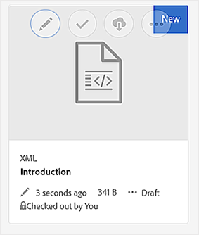

# Visualizzare l&#39;anteprima di un argomento {#id1696II000QR}

Una volta creato un argomento, le guide AEM generano un&#39;anteprima dell&#39;argomento. La modalità Anteprima offre diverse funzionalità che è possibile utilizzare per l&#39;utilizzo del documento.

Per visualizzare in anteprima un argomento, effettua le seguenti operazioni:

1. Nell’interfaccia utente Assets, individua l’argomento da visualizzare.
1. Fare clic sull&#39;argomento da visualizzare.

   Nell’interfaccia utente Assets viene visualizzata un’anteprima dell’argomento.

   >[!NOTE]
   >
   > La versione dell&#39;argomento attivo o della mappa DITA è visibile nell&#39;angolo superiore destro della scheda File dell&#39;argomento.

   >[!IMPORTANT]
   >
   > Il posizionamento delle seguenti funzioni nella barra degli strumenti Anteprima potrebbe variare in base alla configurazione del server AEM. Alcune delle funzioni potrebbero essere disponibili nella barra degli strumenti principale, mentre altre nel menu Altro.

## Funzioni disponibili in modalità anteprima

{width="800" align="left"}

Nella modalità anteprima della barra degli strumenti puoi eseguire le seguenti operazioni:

**Proprietà**

Visualizza le proprietà dell&#39;argomento selezionato. In base alla versione dell’AEM in uso, puoi visualizzare proprietà quali metadati, pianificazione \(de\)attivazione, riferimenti, stato del documento e altro ancora.

>[!NOTE]
>
> La proprietà del titolo di un argomento viene compilata automaticamente dal `title` dell&#39;argomento o della mappa DITA. Se si apportano modifiche al titolo utilizzando la finestra delle proprietà, tali modifiche andranno perse. Se desideri aggiornare la proprietà title, utilizza l’editor web.

La pagina Proprietà contiene informazioni utili sui riferimenti, ad esempio dove viene utilizzata una mappa o un argomento oppure quali riferimenti sono contenuti in un documento. Nella pagina Proprietà sono elencati due tipi di riferimenti per un documento: **Utilizzato in** e **Riferimenti in uscita**.

Il **Utilizzato in** i riferimenti elencano i documenti in cui viene fatto riferimento o utilizzato il file corrente. Il **Riferimenti in uscita** elenca i documenti a cui si fa riferimento nel documento corrente.

L&#39;icona \(+\) in **Utilizzato in** sezione dei riferimenti consente di spostarsi ulteriormente verso l’alto per trovare dove l’argomento viene utilizzato o a cui si fa riferimento.

{width="800" align="left"}

Facendo clic su accanto a un documento vengono visualizzati i file mappa o argomento in cui il documento viene ulteriormente inviato.

**Filtro condizionale \(A/B\)**

Se il tuo argomento ha contenuto condizionale, sulla barra degli strumenti verrà visualizzata l’icona A/B. Facendo clic su questa icona si apre un pop-up che consente di filtrare il contenuto in base alle condizioni disponibili nell’argomento.

>[!NOTE]
>
> Il contenuto condizionale viene evidenziato utilizzando il colore di sfondo chiaro nell’editor web.

{width="300" align="left"}

**Modifica**

- Aprire l&#39;argomento per la modifica nell&#39;Editor Web. Il **Modifica** non sarà disponibile se l&#39;amministratore ha abilitato l&#39;opzione **Disattiva modifica senza estrazione** opzione. Con l’opzione abilitata, visualizzerai **Modifica** solo dopo aver estratto un file argomento.

**Risoluzione chiave**

- Se si desidera utilizzare un file keyspace per l&#39;argomento, fare clic sull&#39;icona Risoluzione tasti. Potete quindi scegliere uno spazio chiave dalla finestra a comparsa Risoluzione chiave.

**Origine**

- Aprire il codice sorgente XML di un file. Per visualizzare il codice XML sottostante di un file mappa, argomento o DITAVAL, aprire il file in modalità Anteprima e fare clic sull&#39;icona Origine. Nel pop-up Origine XML viene visualizzato il codice sorgente XML. È possibile selezionare un codice specifico dal file o premere `Ctrl`+`a` per selezionare l&#39;intero contenuto.

  >[!NOTE]
  >
  > Per visualizzare il codice sorgente di un file di mappa DITA, selezionalo nell’interfaccia utente di Assets e fai clic su Origine.

  {width="800" align="left"}

**Condividi collegamento UUID**

- Le guide AEM consentono di condividere i collegamenti basati su UUID per mappe DITA, argomenti e file di immagini dalle seguenti posizioni:

   - Interfaccia utente Assets
   - Console della mappa DITA
   - Anteprima argomento o immagine

Una nuova opzione **Condividi collegamento UUID** è visualizzato nella barra degli strumenti delle aree sopra indicate. La schermata seguente mostra **Condividi collegamento UUID** nella modalità Anteprima di un argomento:

{width="800" align="left"}

Nell’interfaccia utente Assets, questa opzione è visibile quando selezioni un file. In modalità Anteprima, questa opzione è disponibile per impostazione predefinita nella barra degli strumenti principale. In una console di mappe DITA, questa opzione è visibile nella sezione Predefiniti di output.

Una volta copiato l’URL, lo stesso può essere condiviso con altri utenti per consentire loro di accedere direttamente al file. Questo collegamento rimane valido anche quando il file viene spostato in un’altra posizione nell’archivio. L’unica volta che il collegamento non riesce è quando il file viene eliminato dal repository.

Se condividi il collegamento dalla console delle mappe DITA o dalla modalità di anteprima di un file, l’utente passa alla stessa visualizzazione del file. Tuttavia, quando condividi il collegamento di un file mappa dall’interfaccia utente Assets, l’utente viene indirizzato alla console della mappa. Analogamente, per un file di argomento o immagine viene visualizzata l&#39;anteprima del file.

>[!IMPORTANT]
>
> Il collegamento non può essere utilizzato come collegamento di riferimento in un altro argomento, ma fornisce solo accesso diretto al file nell’archivio. Inoltre, il collegamento rimane valido finché il file è disponibile nell’archivio. Anche se il file viene spostato in un’altra posizione nell’archivio, il collegamento rimane valido. Il collegamento avrà esito negativo solo quando il file viene eliminato dal repository.

**Check-Out/Check-In**

- Attiva/disattiva le funzioni Check-Out e Check-In. Quando un file viene estratto, l&#39;utente corrente ottiene un&#39;autorizzazione di scrittura esclusiva sul file. Un file estratto può essere aperto nell&#39;editor Web per la modifica. Dopo aver apportato le modifiche necessarie, fai clic sull’icona Archivia per salvare il file in DAM.

Quando si estrae un argomento, lo stato del file viene visualizzato come estratto nella vista a schede e nella vista a elenco.

File estratto nella vista a schede:

{width="300" align="left"}

File estratto nella visualizzazione elenco:

{width="550" align="left"}

Se la colonna Estratto non è visibile, selezionare **Impostazioni vista** in **Vista a elenco** e seleziona la **Ritirato** stato in **Configura colonne** .

{width="800" align="left"}

>[!TIP]
>
> Consulta la sezione Controllo delle versioni del contenuto nella guida alle best practice per informazioni sulle procedure consigliate per l’estrazione e l’archiviazione dei file.

**Differenza di versione basata sul Web**

- Se l&#39;argomento è stato modificato, è possibile individuare facilmente le modifiche apportate in versioni diverse dell&#39;argomento. Per individuare le modifiche apportate a versioni diverse di un argomento:

  >[!IMPORTANT]
  >
  > Il metodo descritto nella procedura seguente è applicabile solo ai file DITA. Per i file non DITA, utilizzate la vista Timeline per creare versioni o ripristinare una versione esistente di un file.

   1. Aprire l&#39;argomento in modalità Anteprima.

   1. Nella barra a sinistra, fai clic su **Cronologia versioni** e seleziona una versione.

      {width="800" align="left"}

   1. Dalle versioni elencate, seleziona quella che desideri utilizzare come versione di base e fai clic su **Anteprima versione**. L&#39;anteprima della versione selezionata viene visualizzata nella finestra Anteprima versione.

   1. Dalla sezione **Mostra differenze** selezionare la versione con cui si desidera confrontare la versione di base.

      {width="800" align="left"}

      Il contenuto modificato viene evidenziato nell’anteprima dell’argomento. Il contenuto evidenziato in verde indica che il contenuto appena aggiunto e il contenuto in rosso quello eliminato.

      {width="800" align="left"}

### Branch, ripristino e versioni successive {#id193PG0Y051X}

- In un ambiente di authoring tipico, è necessario creare un nuovo ramo di un argomento per soddisfare una versione specifica. Come qualsiasi altro sistema di gestione delle versioni, le guide AEM consentono di creare un ramo da una versione esistente di un argomento o di ripristinare una versione precedente di un argomento. Utilizzando le funzioni di gestione delle versioni offerte dalle guide AEM, puoi eseguire le seguenti attività:

   - Creare un ramo da una versione esistente di un argomento
   - Creare versioni successive in un nuovo ramo
   - Ripristino di una versione specifica di un argomento

  Nella figura seguente viene illustrato il tipico sistema di ramificazione e di versioni successive:

  {width="550" align="center"}

  Per qualsiasi nuovo argomento, la prima versione viene numerata come 1.0. In seguito, ogni nuova versione dell&#39;argomento viene salvata con un numero incrementale come 1.1, 1.2 e così via. Dopo aver creato un ramo di un argomento, viene creato un nuovo ramo che prende il numero di versione dal punto in cui è stato creato il ramo e aggiunge 0 alla fine della versione. Come mostrato nell’illustrazione, viene creato un nuovo ramo dalla versione 1.1 di un argomento. Il nuovo ramo dispone di una versione 1.1.0. Successivamente, ogni volta che si salva una nuova versione dell&#39;argomento in questo ramo, viene assegnato un numero di versione incrementale, ad esempio 1.1.1, 1.1.2 e così via.

  Analogamente alla diramazione, è inoltre possibile ripristinare la versione in uso o corrente a qualsiasi versione esistente nell&#39;archivio. Per ripristinare una versione, seleziona semplicemente la versione desiderata dell’argomento e fai clic su **Ripristina questa versione** nel **Cronologia versioni** pannello.

  Per creare un ramo, ripristinare una versione e gestire le versioni successive di un argomento, effettua le seguenti operazioni:

  >[!IMPORTANT]
  >
  > Il metodo descritto nella procedura seguente è applicabile solo ai file DITA. Per i file non DITA, utilizzate la vista Timeline per creare versioni o ripristinare una versione esistente di un file.

   1. Accedi all’argomento nell’interfaccia utente di Assets.

      >[!NOTE]
      >
      > È inoltre possibile aprire l&#39;argomento in modalità Anteprima e procedere con il passaggio 3.

   1. Selezionare l&#39;argomento per il quale si desidera creare un ramo.

   1. Nella barra a sinistra, fai clic su **Cronologia versioni**.

      >[!NOTE]
      >
      > Viene visualizzato un elenco delle versioni disponibili per l&#39;argomento selezionato. Ogni versione contiene la marca temporale, il nome utente, il commento sulla versione e [etichetta](web-editor-use-label.md#) informazioni.

   1. Seleziona una versione da cui desideri creare un ramo. Nella schermata seguente, è selezionata la versione 1.2 per la creazione di un ramo.

      {width="300" align="left"}

      >[!NOTE]
      >
      > La versione corrente di un argomento contiene *\(Corrente\)* indicato accanto al numero di versione.

   1. Clic **Ripristina questa versione**.

      Viene visualizzato un messaggio che richiede di confermare la creazione di un nuovo ramo.

   1. *\(Facoltativo\)* Nel prompt dei messaggi, viene visualizzata un&#39;opzione per selezionare **Salva La Copia Di Lavoro Corrente Come Nuova Versione**. In base alla selezione di questa opzione sono possibili le due azioni seguenti:

      - Se selezioni questa opzione, viene creato un ramo dalla versione 1.1. Viene inoltre creata una nuova versione dell&#39;argomento dalla copia di lavoro corrente dell&#39;argomento e salvata come versione successiva, ovvero 1.4.

        {width="300" align="left"}

        La versione 1.2 diventa la copia corrente dell&#39;argomento. Qualsiasi versione salvata dopo questa viene creata nel nuovo ramo di 1.1. Ad esempio, la versione successiva di un nuovo argomento in questo ramo verrà salvata come 1.2.0.

        {width="300" align="left"}

      - Se non si seleziona questa opzione, non verrà creata alcuna nuova versione dalla copia di lavoro corrente dell&#39;argomento. Dalla versione 1.2 dell’argomento viene creato un nuovo ramo. Qualsiasi versione successiva dell’argomento viene salvata nel ramo 1.2 come 1.2.0, 1.2.1 e così via.

        {width="300" align="left"}

   1. Fai clic su **OK**.

  Viene creato un nuovo ramo dalla versione selezionata dell&#39;argomento. Il processo descritto sopra è applicabile anche per il ripristino di una versione specifica di un argomento. Il ripristino di una versione specifica implica tecnicamente la creazione di un nuovo ramo dalla versione selezionata e l&#39;impostazione di tale versione come copia di lavoro corrente dell&#39;argomento. È inoltre possibile visualizzare la cronologia dei file ripristinati nel rapporto Cronologia ripristino versione. Per ulteriori dettagli su questo rapporto, vedi [Rapporto cronologia versioni file ripristinati](reports-reverted-file-version-history.md#).

**Argomento padre:**[ Creazione e anteprima di argomenti](create-preview-topics.md)
