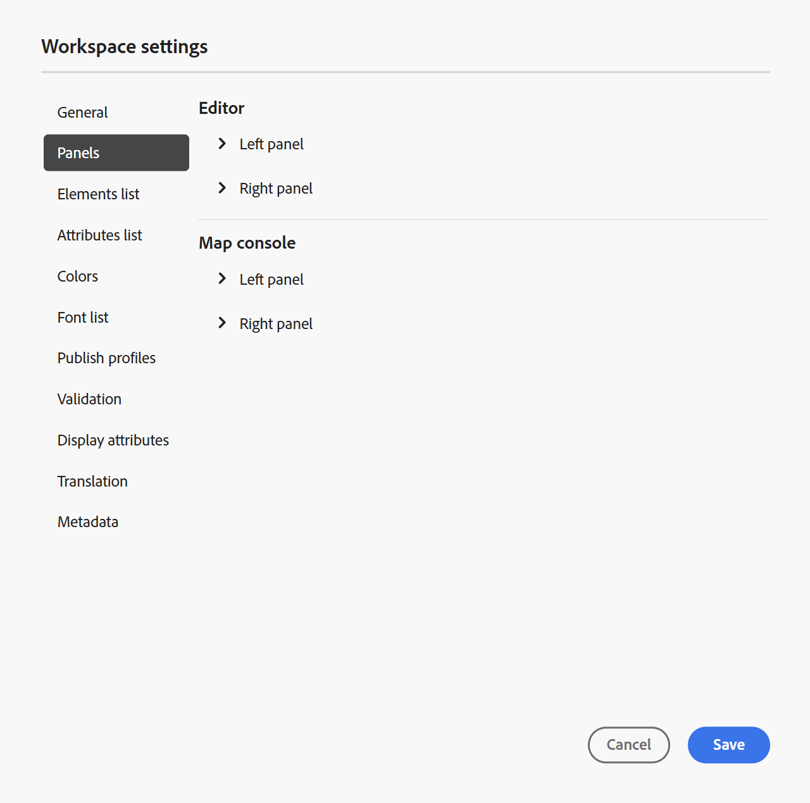
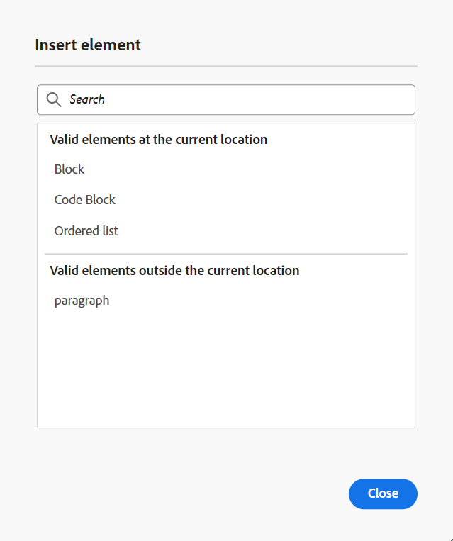

# Impostazioni editor

L&#39;opzione **Impostazioni** presente nella [barra delle schede](./web-editor-tab-bar.md) dell&#39;editor è disponibile solo per gli amministratori e gli amministratori dei profili di cartella e consente di configurare le impostazioni seguenti:

- [Generale](#general)
- [Pannelli](#panels)
- [Elenco elementi](#elements-list)
- [Elenco attributi](#attributes-list)
- [Colori](#colors)
- [Pubblicare i profili](#publish-profiles)
- [Convalida](#validation)
- [Visualizza attributi](#display-attributes)
- [Traduzione](#translation)
- [Metadati](#metadata)

>[!NOTE]
>
> Se si stanno aggiornando le impostazioni predefinite, è necessario riaprire i documenti per rendere effettive le modifiche.

## Generale

Le impostazioni generali consentono di configurare le impostazioni per l&#39;utilizzo dell&#39;editor. Questa scheda contiene cinque sezioni: **Assistente IA**, **Authoring**, **Citazioni**, **Condizione** e **Controllo ortografico**.

{width="350" align="left"}

- **Assistente IA**
Selezionare questa opzione per abilitare la funzionalità [Assistente AI](./ai-assistant.md) in Experience Manager Guides. Deselezionate questa opzione per disattivare la feature.

  Dopo aver attivato l&#39;Assistente di **IA**, è possibile configurare le opzioni visualizzate nella **scheda Authoring** per gli autori utilizzando il menu **Azioni rapide di authoring** come illustrato di seguito.\
  Queste modifiche si applicano al profilo di cartella specifico con cui stai lavorando. Se crei un nuovo profilo di cartella, questo erediterà le impostazioni dell&#39;editor definite nel profilo di cartella **Global** per impostazione predefinita. Puoi modificare queste impostazioni in base alle esigenze utilizzando **Impostazioni editor** e salvare la configurazione aggiornata.\
  Per una panoramica dettagliata delle opzioni disponibili per l&#39;authoring mediante l&#39;Assistente all&#39;intelligenza artificiale, visualizzare [i documenti creati in modo intelligente con l&#39;Assistente all&#39;intelligenza artificiale](./ai-assistant-right-panel.md).

  Dal menu **Creazione di azioni rapide** puoi effettuare le seguenti operazioni:

   - utilizza gli interruttori per abilitare o disabilitare opzioni specifiche a cui gli autori possono accedere quando lavorano con l’Assistente IA.

   - modifica l’ordine di visualizzazione delle opzioni, trascinale e rilasciale in base alle esigenze.

  {width="350" align="left"}

- **Authoring**

   - **Abilita Sostituisci Tutto**: selezionare questa opzione per visualizzare l&#39;icona **Sostituisci Tutto** nel pannello **Trova e sostituisci**.

- **Citazioni**

  Modificare lo stile delle citazioni. Scegli lo stile di citazione dal menu a discesa che desideri utilizzare nel progetto. Per ulteriori dettagli, visualizzare [Modifica stili citazione](./web-editor-apply-citations.md#change-citation-style).

- **Condizione**

   - **Evidenzia testo condizionale nella visualizzazione Autore**: selezionare questa opzione per evidenziare il testo condizionale nella visualizzazione Autore. Il contenuto condizionale viene evidenziato utilizzando il colore definito per la condizione.

   - **Convalida con attributi di condizione**: selezionare questa opzione per consentire la convalida dei valori definiti per gli attributi. Questo impedisce l’aggiunta di valori errati.

   - **Mostra chiave con titolo nel pannello Schema soggetti**: selezionare questa opzione per visualizzare i tasti insieme ai titoli nello schema soggetti. Se non si seleziona questa opzione, vengono visualizzati solo i titoli. Ad esempio, in questo caso, insieme ai titoli vengono visualizzati anche i tasti &quot;os&quot;, &quot;audience&quot; e &quot;other&quot;.

     {width="550" align="left"}

   - **Mostra schema soggetto nel pannello Condizioni**: selezionare questa opzione per visualizzare uno schema soggetto nel pannello Condizioni. Se deselezionate questa opzione, le condizioni definite vengono visualizzate nel pannello condizioni.

- **Controllo ortografico**
Sono disponibili due opzioni: **Controllo ortografico AEM** e **Controllo ortografico browser**. Per impostazione predefinita, l’editor utilizza la funzione di controllo ortografico del browser, in cui il controllo ortografico viene eseguito utilizzando il dizionario integrato del browser. Puoi passare al controllo ortografico di AEM per utilizzare il dizionario Adobe Experience Manager, che può anche essere personalizzato per aggiungere un elenco di parole personalizzato. Per ulteriori informazioni sulla personalizzazione del dizionario AEM, vedere la sezione [Personalizzare il dizionario predefinito di AEM](../cs-install-guide/customize-aem-custom-dictionary.md) nell&#39;area Installare e configurare Adobe Experience Manager Guides as a Cloud Service.

## Pannelli

Questa impostazione consente di controllare i pannelli visualizzati nei pannelli sinistro e destro della console Editor e Mappa. Puoi attivare o disattivare il pulsante per mostrare o nascondere il pannello desiderato.

{width="650" align="left"}

Potete anche definire l&#39;ordine di visualizzazione delle feature presenti nei pannelli. Per modificare l&#39;ordine di default delle feature disponibili nei pannelli, selezionate le barre punteggiate per trascinare e rilasciare le linguette delle feature nella posizione desiderata. Una funzione può anche essere spostata dalla sezione **Altro** alla sezione principale di un pannello e viceversa in base al requisito. Una volta riordinate, le feature vengono visualizzate nella stessa sequenza nei rispettivi pannelli destro e sinistro.

{width="650" align="left"}

È possibile visualizzare fino a otto pannelli alla volta. Tutte le modifiche apportate alle impostazioni del pannello vengono applicate immediatamente.

>[!NOTE]
>
> Se è stato configurato un pannello personalizzato, viene visualizzato anche nell’elenco dei pannelli. È possibile attivare o disattivare l&#39;opzione per mostrare o nascondere il pannello personalizzato.

## Elenco elementi

In qualità di amministratore, puoi controllare l’elenco degli elementi che un autore può inserire in un file e definire anche il nome visualizzato dell’elemento. L&#39;impostazione dell&#39;elenco Elementi consente di specificare il nome dell&#39;elemento in base alle specifiche DITA e un&#39;etichetta che si desidera utilizzare al posto del nome dell&#39;elemento definito DITA:

{width="650" align="left"}

Nella schermata precedente, all&#39;elemento `p` è stata assegnata un&#39;etichetta di Paragrafo e a `codeblock` viene assegnata un&#39;etichetta di Blocco di codice insieme ad alcuni altri elementi. Se si seleziona l&#39;opzione **Usa solo elementi superiori**, nella finestra di dialogo **Inserisci elemento** verranno visualizzati solo gli elementi validi \(al punto di inserimento corrente\) di questo elenco.

Nella schermata seguente, solo 3 su 4 elementi configurati dalla schermata precedente sono visualizzati nel contesto corrente:

{width="300" align="left"}

## Elenco attributi

Analogamente all&#39;elenco degli elementi, è possibile controllare l&#39;elenco degli attributi e i relativi nomi visualizzati da visualizzare nell&#39;elenco degli attributi di un elemento. Nella schermata seguente, solo 3 attributi sono stati configurati per essere visualizzati nell’elenco degli attributi di un elemento:

{width="650" align="left"}

Con questa impostazione, quando si tenta di aggiungere un attributo a un elemento, viene visualizzato solo l’elenco degli attributi configurati nell’elenco.

{width="300" align="left"}

## Colori

Visualizza un elenco di colori di sfondo preconfigurati per **Condizioni**. Gli utenti possono selezionare un colore di sfondo quando applicano una condizione a un argomento. In qualità di amministratore, puoi anche creare e aggiungere colori di sfondo personalizzati all’elenco. Per aggiungere un nuovo colore, immettere il nome desiderato nel campo **Nome colore**, scegliere un colore personalizzato e selezionare l&#39;icona **+**. Il colore personalizzato verrà visualizzato alla fine dell&#39;elenco dei colori.

## Pubblicare i profili

Contiene i profili utilizzabili per pubblicare l&#39;output **Knowledge Base**. È possibile creare un nuovo profilo per una knowledge base di destinazione. Ad esempio, Salesforce o ServiceNow.

**Crea un profilo Salesforce**

**Prerequisiti**

- Crea un&#39;app connessa per Salesforce. Per ulteriori dettagli, consulta [Abilitare le impostazioni OAuth per l&#39;integrazione API](https://help.salesforce.com/s/articleView?id=sf.connected_app_create_api_integration.htm&type=5).

- Durante la configurazione dell’app connessa, verifica quanto segue:

   - Specifica il callback.

     `URL: http://<server name>:<port>/bin/dxml/thirdparty/callback/salesforce`

   - Selezionate i seguenti ambiti OAuth:
      - Accesso completo (completo)
      - Seleziona Gestisci dati utente tramite API (api)

     Una volta configurata l&#39;app, Salesforce fornisce **Chiave consumer** e **Segreto consumer**. Possono essere utilizzati per creare il profilo Salesforce.

   - Per creare un profilo Salesforce, selezionare la Knowledge Base **Salesforce** dal menu a discesa **Tipo di server**. Immettere un nome di profilo. Nell&#39;**URL sito**, immettere il sito consumer da utilizzare per pubblicare l&#39;output, quindi aggiungere la **Chiave consumer** e il **Segreto consumer** forniti dal sito consumer di Salesforce. Quindi **Convalida** e **Salva** il nuovo profilo creato.

     {width="550" align="left"}

     >[!NOTE]
     >
     >Per configurare un proxy per Salesforce in Experience Manager Guides, utilizza la configurazione proxy dei componenti HTTP Apache in AEM. Scopri come [configurare il proxy per AEM Link Checker](https://helpx.adobe.com/experience-manager/kb/How-to-configure-proxy-for-the-AEM-Link-Checker-AEM.html).

**Creare un profilo ServiceNow**

**Prerequisiti**

Configura il server ServiceNow per caricare le risorse.

- Connetti al server **ServiceNow**.
- Passa a **Proprietà di sistema** > **Sicurezza**.
- Deseleziona la seguente opzione:

  **Questa proprietà deve essere impostata per attivare la verifica del tipo MIME per i caricamenti (tutte le versioni Eureka e successive). Abilita (true) o disabilita (false) la convalida del tipo MIME per i file allegati. Le estensioni file configurate tramite glide.attachment.extensions verranno controllate per verificare la presenza di tipi MIME durante il caricamento.**

- Seleziona **Salva**.

  Dopo aver configurato l&#39;app, crea il profilo **ServiceNow**.

- Per creare un profilo, selezionare la Knowledge Base ServiceNow dal menu a discesa **Tipo di server**. Immetti un profilo **Nome**. Nell&#39;**URL ServiceNow**, immettere il sito consumer da utilizzare per la pubblicazione dell&#39;output, quindi aggiungere **Nome utente** e **Password** forniti dal sito consumer ServiceNow. Quindi **Convalida** e **Salva** il nuovo profilo creato.

  {width="550" align="left"}

  Dopo la convalida, è possibile selezionare il profilo di pubblicazione nei predefiniti di output di una mappa DITA e utilizzarlo per generare l&#39;output nel server **Salesforce** o **ServiceNow** scelto.

  Ulteriori informazioni sul predefinito di output [Knowledge Base](../user-guide/generate-output-knowledge-base.md).

## Convalida

Questa scheda contiene le opzioni per configurare le convalide Schematron nell’Editor. È possibile attivare le seguenti funzionalità:

- **Eseguire il controllo di convalida prima di salvare il file**: selezionare questa opzione per eseguire le convalide Schematron utilizzando i file Schematron selezionati prima di eseguire qualsiasi operazione di salvataggio. Potete aggiungere un file Schematron selezionando l&#39;icona +. Vengono elencati i file Schematron selezionati.

  >[!NOTE]
  >
  > I file Schematron selezionati persisteranno per il profilo di cartella selezionato.

  {width="550" align="left"}

  In questo modo si impedisce agli utenti di salvare qualsiasi file che non rispetti una regola definita nei file Schematron selezionati. Se questa opzione non è selezionata, il file non verrà convalidato prima di salvare le modifiche.

- **Consenti a tutti gli utenti di aggiungere file schematron nel pannello di convalida**: selezionare questa opzione per consentire agli utenti di aggiungere qualsiasi file Schematron nel pannello di convalida dell&#39;editor. Questo consente agli utenti di aggiungere file Schematron e quindi convalidare gli argomenti rispetto al file Schematron. Se questa opzione non è selezionata, l&#39;opzione per aggiungere il file schematron **Aggiungi file schematron** non è disponibile per gli utenti nel **pannello di convalida** dell&#39;editor.

## Visualizza attributi

Analogamente all&#39;elenco Attributi, è possibile controllare l&#39;elenco degli attributi da visualizzare nell&#39;elenco degli attributi di un elemento. Per impostazione predefinita, quattro **Attributi di visualizzazione**: pubblico, piattaforma, prodotto e proprietà sono stati configurati per essere visualizzati nell&#39;elenco degli attributi di un elemento. Puoi anche aggiungere un attributo di visualizzazione utilizzando l&#39;icona **Aggiungi** nella parte superiore. Puoi anche eliminare gli attributi di visualizzazione utilizzando l&#39;icona **Elimina**.

Gli attributi definiti per un elemento vengono visualizzati nella vista Layout e Struttura.

{width="550" align="left"}

## Traduzione

Questa scheda contiene le opzioni per creare gruppi di lingue, propagare le etichette di origine alla versione di destinazione e ripulire il progetto di traduzione.

{width="550" align="left"}

- **Gruppi di lingue**: in qualità di amministratore, puoi creare un gruppo di lingue e utilizzarle come set per tradurre il contenuto.

  Per creare un nuovo gruppo di lingue, effettuare le operazioni riportate di seguito.

   1. Seleziona **Aggiungi**.
   1. Immettere il nome del gruppo di lingue. Ogni lingua deve avere un nome univoco. È possibile visualizzare un errore se il campo del nome è vuoto o se il nome non è univoco.
   1. Seleziona le lingue dal menu a discesa. È possibile selezionare più lingue.

      Digita i primi caratteri della lingua o il codice della lingua per filtrare le lingue desiderate. Digitare ad esempio &#39;en&#39; per filtrare tutte le lingue che contengono &#39;en&#39; all&#39;inizio del nome o del codice.

   1. Selezionate l&#39;icona Fine (Done) per aggiungere le lingue selezionate al gruppo. Vengono visualizzate le lingue. Quando si aggiungono tre o più lingue, viene visualizzata l&#39;opzione **Mostra altro**. È possibile selezionare **Mostra altro** per visualizzare tutte le lingue presenti nel gruppo.

      >[!TIP]
      >
      > Attiva **Mostra altro** in **Mostra meno** e visualizza solo alcune lingue.

   1. Passa il puntatore del mouse sulle lingue di un gruppo per modificare  o eliminare  i gruppi di lingue.
   1. Salva le **impostazioni**.

      >[!NOTE]
      >
      >In qualità di utente, puoi visualizzare i gruppi di lingue configurati nel tuo profilo di cartella.

- **Propagare le etichette della versione di origine alla versione di destinazione**: selezionare questa opzione per passare l&#39;etichetta della versione del file di origine al file tradotto. Per impostazione predefinita, questa opzione è disabilitata.
- **Pulizia del progetto di traduzione dopo il completamento**: seleziona questa opzione per configurare i progetti di traduzione da disabilitare o eliminare automaticamente dopo la traduzione. Per impostazione predefinita, è selezionato **Nessuno**, in modo che il progetto esista dopo la traduzione.

  Puoi disattivare i progetti di traduzione se desideri utilizzarli in un secondo momento. L’eliminazione di un progetto comporta l’eliminazione definitiva di tutti i file e le cartelle presenti nel progetto.

## Metadati

È possibile controllare i metadati della versione dell&#39;argomento e i relativi valori da visualizzare nella finestra di dialogo **Cronologia versioni**.  Nel percorso metadati, specifica la posizione dei nodi da cui desideri scegliere i metadati. Puoi anche definire un nome personalizzato per i metadati come etichetta. Le proprietà predefinite sono Titolo, Stato documento e Tag.

I metadati possono essere scelti da qualsiasi proprietà sotto il nodo `/jcr:content` della risorsa, in modo da poter aggiungere il percorso della proprietà come percorso dei metadati.

Se il percorso dei metadati è vuoto, viene visualizzato un errore. Se si lascia vuota l&#39;etichetta, l&#39;ultimo elemento viene scelto come etichetta.

{width="550" align="left"}

*Configurare i metadati per la finestra di dialogo **Cronologia versioni**.*

Puoi anche definire l’ordine in cui vengono visualizzati questi tag di metadati. Per modificare l’ordine predefinito di questi tag, seleziona le barre punteggiate per trascinare i tag nella posizione desiderata.
Le etichette metadati vengono visualizzate nella stessa sequenza nella finestra di dialogo **Cronologia versioni** dell&#39;editor.

**Argomento padre:**&#x200B;[ Introduzione all&#39;editor](web-editor.md)
