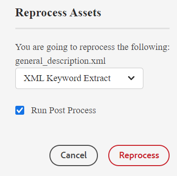
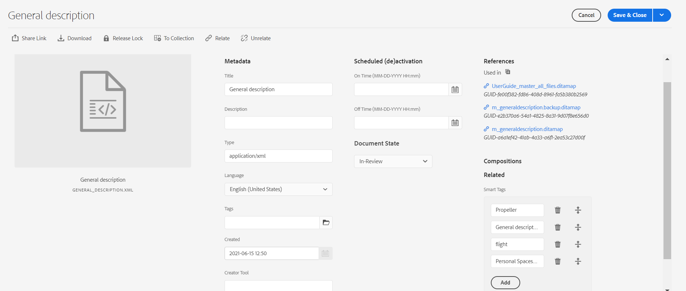

# Applicazione di tag avanzati {#id216KH0ID0Y8}

>[!IMPORTANT]
>
> La funzione di assegnazione tag avanzati non è disponibile e richiede un’implementazione personalizzata per la quale è necessario consultare l’amministratore di sistema.

Le guide AEM includono la funzione per aggiungere tag avanzati. È possibile utilizzare lo strumento Estrazione parole chiave XML per estrarre tag avanzati. Questo strumento utilizza l’intelligenza artificiale per comprendere il contenuto e fornire parole chiave rilevanti. Puoi utilizzare i tag avanzati per migliorare l’ottimizzazione SEO (Search Engine Optimization) e aiutare gli utenti a trovare i contenuti correlati.

Per creare tag avanzati, effettua le seguenti operazioni:

1. Nell’interfaccia utente Assets, individua l’argomento per il quale vuoi creare gli smart tag.
1. Apri l’argomento in modalità Anteprima e seleziona **Rielabora risorse** dalla barra degli strumenti principale.
1. Selezionare Estrai parole chiave XML per estrarre le parole chiave rilevanti.

   {width="300" align="left"}

1. Selezionare l&#39;opzione Esegui post-elaborazione. Viene visualizzato un messaggio quando lo strumento viene avviato correttamente.
1. I tag vengono estratti automaticamente e possono essere visualizzati nella pagina Proprietà dell&#39;argomento selezionato.

   {width="800" align="left"}

   >[!NOTE]
   >
   > Oltre a estrarre le parole chiave tramite lo strumento Estrazione parole chiave XML, è possibile aggiungere, eliminare o personalizzare gli smart tag nella pagina delle proprietà.

*Contatta il team di successo del cliente per abilitare questa funzione nell’ambiente. Questa funzione non è abilitata come parte del supporto predefinito.*

**Argomento padre:**[ Gestione metadati](manage-metadata.md)
