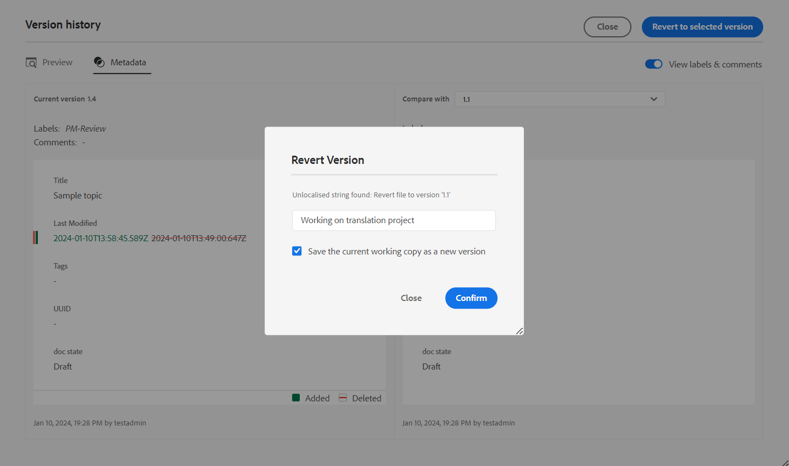
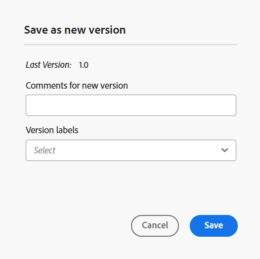

# Barra degli strumenti nell’editor

La barra degli strumenti viene visualizzata quando si apre un argomento o una mappa per la modifica nell&#39;editor. Le funzioni disponibili nella barra degli strumenti sono le seguenti:

- [Menu a discesa](#menu-dropdown)
- [Opzioni di inserimento contenuti](#content-insertion-options)
- [Informazioni sulla versione e pulsante Salva come nuova versione](#version-information-and-save-as-new-version)
- [Blocca/sblocca](#lockunlock)

>[!NOTE]
>
> Le funzioni elencate sopra sono applicabili solo ai file di argomento. Quando si lavora con un file mappa, nella barra degli strumenti vengono visualizzate opzioni diverse in base alla vista dell’editor mappa corrente. Scopri le opzioni della barra degli strumenti dell&#39;editor mappe nel documento [Funzioni dell&#39;editor mappe](./map-editor-advanced-map-editor.md).

## Menu a discesa

Il menu a discesa Menu consente di accedere alle azioni di modifica Trova e sostituisci, Cronologia versioni, Etichetta versione, Unisci, Crea attività di revisione e Mostra menu (che include Revisioni, Tag, Spazio unificatore).

{width="350" align="left"}

La spiegazione dettagliata di queste funzioni è la seguente:

**Modifica delle azioni**

Durante la modifica di un argomento nell&#39;editor, accedere alle varie azioni di modifica, ad esempio **Taglia** o ***Ctrl***+***X*** , **Copia** o ***Ctrl***+***C*** , **Annulla** o ***Ctrl***+***Z*** , **Ripristina** o ***Ctrl***+***Y*** e **Elimina** presente nel menu a discesa.

**Trova e sostituisci**

La funzionalità **Trova e sostituisci** è disponibile nelle modalità di visualizzazione Creazione e Source. Quando questa opzione è attivata, la barra di testo Trova e sostituisci viene visualizzata nella parte inferiore dell&#39;area di modifica dell&#39;argomento. È possibile utilizzare i tasti di scelta rapida **CTRL**+**F** per richiamare la barra Trova e sostituisci.

{align="left"}

Utilizzando l&#39;icona delle impostazioni \(\), è possibile attivare/disattivare le opzioni di ricerca **Ignora maiuscole/minuscole** e **Solo parole intere**. Per eseguire la ricerca senza distinzione tra maiuscole e minuscole, attivare \(o selezionare\) l&#39;opzione **Ignora maiuscole/minuscole**. Se invece si desidera eseguire la ricerca con distinzione tra maiuscole e minuscole, disattivare \(o deselezionare\) l&#39;opzione **Ignora maiuscole/minuscole**. È inoltre possibile scegliere di cercare una parola intera.

La ricerca è istantanea, il che significa che quando si digita la frase o la parola di ricerca nel campo **Trova**, il termine viene immediatamente cercato e selezionato nell&#39;argomento. Analogamente, per sostituire un testo nell&#39;argomento, immettere il termine di ricerca e la sua sostituzione nei rispettivi campi e selezionare il pulsante **Sostituisci** o **Sostituisci tutto**.

Nella visualizzazione Source, la funzionalità **Trova e sostituisci** è estremamente utile per la ricerca di un elemento o un attributo specifico. Ad esempio, se desideri sostituire il valore dell&#39;attributo `@product`, puoi eseguirlo facilmente dalla vista Source. La visualizzazione Autore non consente di eseguire ricerche sulla base di un attributo o di un elemento. Tuttavia, è necessario prestare attenzione quando si utilizza la funzionalità **Sostituisci tutto**, in quanto potrebbe sovrascrivere il codice XML.

**Cronologia versioni**

La funzionalità **Cronologia versioni** nell&#39;editor consente di controllare le versioni disponibili dei file DITA, confrontarli e ripristinare qualsiasi versione dall&#39;editor stesso. Puoi confrontare il contenuto e i metadati della versione corrente (che può anche essere una copia di lavoro) con qualsiasi versione precedente dello stesso file. Puoi anche visualizzare le etichette e i commenti per le versioni confrontate.

>[!NOTE]
>
> Le opzioni della cronologia delle versioni vengono visualizzate solo se sono state apportate modifiche alla prima versione dell&#39;argomento o della mappa.

    
 Passaggi per accedere alla cronologia delle versioni 

1. Aprire un argomento nell&#39;editor.
1. Seleziona **Cronologia versioni** dal menu a discesa **Menu**.

   Viene visualizzata la finestra di dialogo **Cronologia versioni**.

   {width="550" align="left"}

   *Visualizzare in anteprima le modifiche nelle diverse versioni di un argomento.*

1. Scegliere una versione dell&#39;argomento da confrontare o ripristinare nell&#39;elenco a discesa **Confronta con**.

   >[!NOTE]
   >
   > Se a una versione sono applicate etichette, queste vengono visualizzate anche \(tra parentesi\) insieme al numero di versione.

1. Abilita l&#39;opzione **Visualizza etichette e commenti** per visualizzare le etichette e i commenti applicati alle versioni corrente e confrontata.
1. È inoltre possibile visualizzare le informazioni seguenti nella finestra di dialogo **Cronologia versioni**:

   Scheda **Anteprima**: il contenuto appena aggiunto è in verde e il contenuto eliminato in rosso.

   Scheda **Metadati**: i metadati appena aggiunti sono in verde e quelli eliminati in rosso.

   {width="550" align="left"}

   *Confrontare i metadati di diverse versioni nella cronologia delle versioni.*

   >[!NOTE]
   >
   > L&#39;amministratore di sistema può modificare i metadati da visualizzare dalla scheda Metadati in **Impostazioni**. Per ulteriori informazioni, consulta la sezione **Altre azioni** della [Barra delle schede](./web-editor-tab-bar.md).

   Puoi anche visualizzare i dettagli dell’utente e dell’ora della versione corrente e della versione confrontata.

   Dopo aver scelto una versione dall&#39;elenco a discesa, è disponibile l&#39;opzione **Ripristina versione selezionata**. Nella finestra di anteprima vengono visualizzate le differenze tra la versione corrente e la versione selezionata dell&#39;argomento.

1. Seleziona **Ripristina la versione selezionata** per ripristinare la copia di lavoro con la versione selezionata dell&#39;argomento.

   Viene visualizzata la finestra di dialogo Ripristina versione.

   {width="550" align="left"}

1. \(*Facoltativo*\) Fornire un motivo per ripristinare una versione precedente. È inoltre possibile creare una nuova versione della copia di lavoro attiva dell&#39;argomento.

1. Seleziona **Conferma**.

   La copia di lavoro del file viene ripristinata alla versione selezionata. Se si sceglie di creare una nuova versione della copia di lavoro attiva, viene creata anche una nuova versione del file con tutte le modifiche di lavoro.

   Quando si ripristina una versione precedente, viene visualizzato un segnale visivo che indica che la versione su cui si sta lavorando non è quella più recente.

   {align="left"}

**Etichette versione**

Le etichette consentono di identificare la fase in cui un particolare argomento si trova nel DDLC \(Document Development Life Cycle\). Ad esempio, quando si lavora su un argomento, è possibile impostare l&#39;etichetta come &quot;Approvato&quot;. Quando un argomento viene pubblicato e reso disponibile ai clienti, puoi assegnare l’etichetta &quot;Rilasciato&quot; a tale argomento.

Experience Manager Guides consente di specificare etichette in formato testo libero o di utilizzare un set di etichette predefinite. L’etichetta personalizzata consente a qualsiasi autore nel sistema di specificare un’etichetta in base alla propria scelta. Questo offre flessibilità, ma introduce etichette non coerenti nel sistema. Per risolvere questo problema, gli amministratori possono configurare un set di etichette predefinite. Per ulteriori informazioni sulla configurazione delle etichette predefinite, visualizzare *Configurare e personalizzare l&#39;editor Web XML* in Installare e configurare Adobe Experience Manager Guides as a Cloud Service.

Queste etichette vengono visualizzate sotto forma di elenco a discesa agli autori ogni volta che devono specificare un’etichetta. In questo modo nel sistema verranno utilizzate solo etichette coerenti e predefinite.

Esistono diversi metodi tramite i quali è possibile applicare etichette agli argomenti: [Pannello Cronologia versioni](web-editor-use-label.md) nell&#39;interfaccia utente di Assets, [Interfaccia baseline](/help/product-guide/user-guide/generate-output-use-baseline-for-publishing.md) e nell&#39;editor. La funzione Etichetta versione nell’editor consente agli autori di assegnare etichette ai loro argomenti in modo rapido e semplice.

    
 Passaggi per aggiungere etichette all’argomento dall’editor 

1. Aprire un argomento nell&#39;editor.

1. Seleziona **Etichette versione** dal menu a discesa.

   Viene visualizzata la finestra di dialogo Gestione etichette versione.

   {width="350" align="left"}

   La finestra di dialogo Gestione etichette versione è suddivisa in due parti: nel pannello a sinistra è disponibile un elenco di versioni per l&#39;argomento con l&#39;elenco a discesa delle etichette \(o una casella di testo per immettere un&#39;etichetta\) e nel pannello a destra con un&#39;anteprima dell&#39;argomento.

1. Selezionare la versione alla quale si desidera applicare le etichette.

   Quando si sceglie una versione diversa dell&#39;argomento dall&#39;elenco delle versioni, nel pannello di anteprima vengono visualizzate le modifiche tra la versione corrente e la versione selezionata dell&#39;argomento

   >[!NOTE]
   >
   > Se un&#39;etichetta è già applicata a una versione, viene visualizzata accanto al numero di versione nell&#39;elenco a discesa e sotto l&#39;elenco Seleziona versione. È possibile rimuovere un&#39;etichetta esistente selezionando l&#39;icona \(**x**\) accanto all&#39;etichetta.

1. Se l&#39;amministratore ha definito un elenco di etichette, viene visualizzato un elenco a discesa delle etichette da cui è possibile scegliere le etichette da applicare. Puoi selezionare più etichette dall’elenco a discesa.

   Viene inoltre visualizzata una casella di testo in cui è possibile immettere le etichette che si desidera aggiungere all&#39;argomento.

   >[!NOTE]
   >
   > Non è possibile applicare la stessa etichetta a più versioni di un argomento. Se si tenta di associare un&#39;etichetta esistente, è possibile rimuoverla dalla versione esistente e applicarla alla versione selezionata dell&#39;argomento.

1. Selezionare **Aggiungi etichetta**.

1. Nel messaggio di conferma Applica etichetta, selezionare l&#39;opzione **Sposta etichetta (se utilizzata in un&#39;altra versione)** per spostare le etichette da una versione esistente alla versione selezionata. Se non si seleziona questa opzione e sono presenti etichette assegnate a una versione diversa dell&#39;argomento, tali etichette non verranno spostate nella versione dell&#39;argomento selezionato. Tali etichette vengono ignorate nel processo di applicazione delle etichette.

**Unisci**

Quando si lavora in un ambiente con più autori, diventa difficile tenere traccia delle modifiche apportate da altri autori in un argomento o in una mappa. La funzione di unione consente di controllare non solo le modifiche, ma anche le modifiche mantenute nell&#39;ultima versione del documento.

    
 Unisci file di argomenti 

Per unire le modifiche in un argomento, effettuare le seguenti operazioni:

1. Aprire un argomento nell&#39;editor.

1. Seleziona **Unisci**.

   Viene visualizzata la finestra di dialogo Unisci.

   {width="550" align="left"}

1. *\(Facoltativo\)* È inoltre possibile sfogliare e selezionare un nuovo file da un&#39;altra posizione nell&#39;archivio.

1. Selezionare una versione del file con cui si desidera confrontare la versione corrente del file.

1. In Opzioni, scegliere:

   - **Rileva modifiche dalla versione selezionata**: questa opzione mostra tutti gli aggiornamenti di contenuto sotto forma di revisioni. È quindi possibile scegliere di accettare o rifiutare le modifiche nel documento una alla volta o tutte contemporaneamente.

   - **Ripristina la versione selezionata**: questa opzione ripristina la versione corrente del documento alla versione selezionata. Questa opzione non consente di controllare quale contenuto viene accettato o rifiutato.

1. Seleziona **Fine**.

1. Se hai selezionato l&#39;opzione **Rileva modifiche dalla versione selezionata**, tutte le modifiche dalla versione selezionata vengono visualizzate nella funzione Tracciamento modifiche nel pannello di destra.

   Potete scegliere di accettare o rifiutare tutti i commenti dal pannello Modifiche tracciate oppure accettare o rifiutare un singolo commento.

    
 Unisci file mappa 

Per unire le modifiche in un file di mappa, effettuare le seguenti operazioni:

1. Apri una mappa nell’editor.

1. Seleziona **Unisci**.

   Viene visualizzata la finestra di dialogo Unisci (Merge).

   {width="550" align="left"}

1. *\(Facoltativo\)* È inoltre possibile sfogliare e selezionare un nuovo file da un&#39;altra posizione nell&#39;archivio.

1. Selezionare una versione del file con cui si desidera confrontare la versione corrente del file.

1. In Opzioni, scegliere:

   - **Rileva modifiche dalla versione selezionata**: questa opzione mostra tutti gli aggiornamenti del contenuto sotto forma di revisioni. È quindi possibile scegliere di accettare o rifiutare le modifiche nel documento una alla volta o tutte contemporaneamente.

   - **Ripristina la versione selezionata**: questa opzione ripristina la versione corrente del documento alla versione selezionata. Questa opzione non consente di controllare quale contenuto viene accettato o rifiutato.

1. Seleziona **Fine**.

1. Se hai selezionato l&#39;opzione **Rileva modifiche dalla versione selezionata**, tutte le modifiche dalla versione selezionata vengono visualizzate nel pannello Revisioni \(a destra\).

   Potete scegliere di accettare o rifiutare tutte le modifiche dal pannello Revisioni tracciate oppure accettare o rifiutare singole modifiche nel file di mappa.

**Crea attività di revisione**

Puoi [creare un&#39;attività di revisione](./review-send-topics-for-review.md) dell&#39;argomento corrente o mappare il file direttamente dall&#39;editor. Aprire il file per il quale si desidera creare l&#39;attività di revisione e selezionare **Crea attività di revisione** dal menu a discesa per avviare il processo di creazione della revisione.

**Mostra menu**

Il menu Mostra (Show) comprende le seguenti funzioni:

- **Rileva modifiche:** È possibile tenere traccia di tutti gli aggiornamenti apportati a un documento abilitando la modalità Rileva modifiche. Dopo aver abilitato le modifiche di traccia, tutti gli inserimenti e le eliminazioni vengono acquisiti nel documento. Tutto il contenuto eliminato viene evidenziato con il metodo Barrato e tutti gli inserimenti vengono evidenziati in verde. Vengono inoltre visualizzate le barre di modifica sul bordo della pagina dell&#39;argomento. Di nuovo, viene visualizzata una barra rossa per il contenuto eliminato e una barra verde per il contenuto aggiunto. Nel caso in cui vi sia un&#39;aggiunta e un&#39;eliminazione sulla stessa riga, vengono visualizzate entrambe le barre verdi e rosse.
La schermata seguente evidenzia il contenuto eliminato e inserito insieme alle barre di modifica:
  {width="650" align="left"}

  Un caso d’uso tipico per il tracciamento delle modifiche in un documento può essere la revisione tra pari. È possibile abilitare la registrazione delle modifiche e condividere il documento per la revisione, quindi il revisore apporta le modifiche con la registrazione delle modifiche attivata. Quando ricevi il documento, dovresti disporre di un meccanismo per visualizzare gli aggiornamenti suggeriti e di un modo pratico per accettare o rifiutare le modifiche.

  In Experience Manager Guides è disponibile la funzione Tracked changes che contiene informazioni sugli aggiornamenti apportati nel documento. La funzione Tracked changes (Modifiche tracciate) fornisce informazioni sugli aggiornamenti effettuati, su chi li ha effettuati e in quale momento. Tramite la funzione Modifiche rilevate, è inoltre possibile accettare o rifiutare facilmente gli aggiornamenti suggeriti nel documento.

  Per accedere alla funzione, seleziona l&#39;icona **Rileva modifiche** nel pannello di destra.

  {width="300" align="left"}

  Se si seleziona una revisione, viene selezionato il contenuto modificato nel documento. Potete accettare una modifica selezionando l&#39;icona Accetta modifica (Accept Change) oppure rifiutarla selezionando Rifiuta modifica (Rifiuta change).

  Per accettare o rifiutare tutte le modifiche con un solo clic, selezionare **Accetta tutte le modifiche** o **Rifiuta tutte le modifiche**.

  >[!NOTE]
  >
  > La modalità Anteprima consente di visualizzare il documento con o senza i markup del contenuto modificato. Per ulteriori dettagli, visualizzare la modalità [Anteprima](web-editor-views.md#preview-mode).

- **Tag:** La funzionalità **Tag** nell&#39;editor è un pulsante che consente di controllare la visibilità degli elementi DITA. Quando questa opzione è attivata, visualizza i tag strutturali all&#39;interno del contenuto, consentendo di visualizzare e gestire gli elementi DITA sottostanti in modo più efficace. Se l’opzione è disabilitata, l’editor nasconde questi tag, fornendo un ambiente di authoring più pulito e mirato.

  La schermata seguente mostra un documento con la vista Tag abilitata:

  {width="650" align="left"}

  In un documento con tag è possibile eseguire le operazioni seguenti:

   - **Seleziona un elemento**: seleziona il tag di apertura o chiusura di un elemento per selezionarne il contenuto.

   - **Espandere o comprimere i tag**: selezionare il segno + o - per espandere o comprimere un tag.

   - **Utilizza il menu di scelta rapida**: il menu di scelta rapida fornisce le opzioni per tagliare, copiare o incollare l&#39;elemento selezionato. Puoi anche inserire un elemento prima o dopo l’elemento selezionato. Le altre opzioni consentono di generare ID o aprire il pannello Proprietà per l’elemento selezionato.

   - **Trascina gli elementi**: seleziona il tag di un elemento e trascinalo facilmente sul documento. Se la posizione di rilascio è una posizione valida in cui l’elemento è consentito, l’elemento viene posizionato nella posizione di rilascio.

  >[!NOTE]
  >
  > Se un utente abilita la vista Tag dall’editor, questa rimane abilitata anche nelle sessioni. Ciò significa che non è necessario abilitare nuovamente la visualizzazione Tag per accedervi in un secondo momento. Il valore predefinito per la visualizzazione Tag per una nuova sessione utente è determinato dalla proprietà `tagsView` nel file `ui\_config.json`. Per ulteriori dettagli, vedi la sezione [Configurare il valore predefinito per la visualizzazione Tag](../cs-install-guide/configure-default-value-tags-view.md) in Installare e configurare Adobe Experience Manager Guides as a Cloud Service.

- **Spazio unificatore:** Abilitare questa opzione per visualizzare un indicatore per gli spazi unificatori durante la modifica nell&#39;editor. È visibile solo nella visualizzazione **Autore** per l&#39;argomento e le mappe DITA.

## Opzioni di inserimento contenuti

**Elemento** - 

Inserisce un elemento valido nella posizione valida corrente o successiva. È inoltre possibile utilizzare la scelta rapida da tastiera ***Alt***+***Invio*** per aprire la finestra di dialogo Elemento. Ad esempio, si sta modificando un paragrafo, quindi nella finestra di dialogo **Elemento** viene visualizzato un elenco di elementi che è possibile inserire nel paragrafo. Seleziona l’elemento da inserire. Puoi usare la tastiera per scorrere l&#39;elenco degli elementi e premere ***Invio*** per inserire l&#39;elemento richiesto.

Puoi visualizzare due tipi di elementi validi:

- **Elementi validi nella posizione corrente**: nell&#39;elenco vengono visualizzati gli elementi che è possibile inserire nella posizione corrente del cursore.

- **Elementi validi al di fuori del percorso corrente**: nell&#39;elenco vengono visualizzati gli elementi che è possibile inserire dopo qualsiasi elemento padre per l&#39;elemento corrente all&#39;interno della gerarchia degli elementi.

Ad esempio, se ti trovi all&#39;interno dell&#39;elemento in linea `<b>`, puoi inserire elementi come `<u>`, `<xref>`, `<i>` nella posizione corrente. È invece possibile inserire elementi come `<table>` e `<topic>` al di fuori del percorso corrente.

È inoltre possibile digitare un carattere o una stringa nella casella di ricerca e cercare gli elementi che iniziano con essa.

{width="300" align="left"}

*Immettere &#39;t&#39; per cercare tutti gli elementi validi che iniziano con &#39;t&#39;.*

Se si lavora all&#39;interno di un elemento blocco come `note`, utilizzare l&#39;icona Inserisci elemento per inserire un nuovo elemento dopo l&#39;elemento `note`. Nella schermata seguente è stato inserito un elemento nota all’interno dell’elemento p \(paragrafo\):

{align="left"}

Se si preme Invio nell&#39;elemento nota, viene creato un nuovo paragrafo all&#39;interno dell&#39;elemento nota stesso. Per inserire un nuovo elemento all&#39;esterno di una nota, seleziona l&#39;elemento p \(evidenziato nella schermata\) nella breadcrumb degli elementi, quindi seleziona l&#39;icona Elemento o premi ***Alt***+***Invio*** per aprire la finestra di dialogo Inserisci elemento. Quindi, selezionate l&#39;elemento desiderato e premete Invio per inserire l&#39;elemento selezionato dopo l&#39;elemento nota.

È inoltre possibile aggiungere un elemento tra due elementi quando viene visualizzato un cursore a blocchi lampeggiante.

{width="300" align="left"}

Ad esempio, se si sta lavorando su un argomento DITA e il cursore di blocco lampeggia tra la breve descrizione e il corpo, è possibile aggiungere l&#39;elemento `prolog` e quindi aggiungere il copyright, l&#39;autore e altri dettagli.

Un altro modo per immettere un nuovo elemento consiste nell’utilizzare il menu di scelta rapida. Fare clic con il pulsante destro del mouse in qualsiasi punto del documento per richiamare il menu di scelta rapida. Da questo menu scegliere **Inserisci elemento** per visualizzare la finestra di dialogo **Inserisci elemento** e scegliere l&#39;elemento che si desidera inserire.

{width="300" align="left"}

**Paragrafo** - 

Inserisce l&#39;elemento paragrafo nella posizione corrente o successiva valida.

**Elenco puntato** - 

Crea un elenco puntato nel percorso valido corrente o successivo. Se ti trovi in un elenco puntato e fai clic su questa icona, l’elemento viene convertito in un paragrafo normale.

**Elenco numerato** - 

Crea un elenco numerato nel percorso valido corrente o successivo. Se fai parte di un elenco numerato e fai clic su questa icona, l’elemento viene convertito in un paragrafo normale.

>[!NOTE]
>
>È inoltre possibile selezionare l&#39;opzione **Dividi elenco** dal menu di scelta rapida di una voce di elenco per dividere l&#39;elenco corrente e iniziare un nuovo elenco allo stesso livello.

**Tabella** - 

Inserisce una tabella nella posizione valida corrente o successiva. Selezionare l&#39;icona Tabella per aprire la finestra di dialogo Inserisci tabella semplice.

{width="550" align="left"}

>[!NOTE]
>
> È inoltre possibile copiare una tabella da MS Word o Excel e incollarla nel file degli argomenti di Experience Manager Guides. La tabella copiata verrà incollata come `<simpletable>` o `<tgroup>` a seconda delle impostazioni configurate nella configurazione dell&#39;editor XML. Per ulteriori dettagli, visualizzare [Configurare la visualizzazione delle tabelle incollate](../cs-install-guide/conf-pasted-tables.md).

È possibile specificare il numero di righe e colonne richieste nella tabella. Se si desidera mantenere la prima riga come intestazione di tabella, selezionare l&#39;opzione **Imposta prima riga come intestazione**. Per aggiungere un titolo alla tabella, immetterlo nel campo Titolo.

Una volta inserita una tabella, è possibile modificarla utilizzando il menu di scelta rapida.

{width="550" align="left"}

Utilizzando il menu di scelta rapida della tabella, è possibile:

- Inserisci celle, righe o colonne

- Unire le celle nelle direzioni destra e giù

- Dividi celle in orizzontale o in verticale

- Eliminare celle, righe o colonne

- Genera ID

    
 Definire gli attributi su più celle, righe intere o colonne di una tabella 

È inoltre possibile definire attributi su più celle, righe intere o colonne di una tabella. Ad esempio, per allineare la cella della tabella, trascinare e selezionare la cella desiderata. Nel pannello Proprietà contenuto (a destra), la proprietà **Type** diventa **entry**.

1. Nella sezione **Attributi**, seleziona **+Aggiungi**.
1. Selezionare l&#39;attributo `@valign` dall&#39;elenco a discesa **Attributo**.
1. Dall&#39;elenco a discesa valore, selezionare l&#39;allineamento del testo che si desidera applicare alle celle di tabella selezionate.
1. Seleziona **Aggiungi.**

{align="left"}

**Immagine** - 

Inserisce un&#39;immagine nel percorso valido corrente o successivo. Selezionare l&#39;icona Immagine per aprire la finestra di dialogo Inserisci immagine, quindi cercare e selezionare l&#39;immagine da inserire.

>[!NOTE]
>
> Puoi anche aggiungere un’immagine trascinandola dal sistema locale sull’articolo. In questo caso, il file di immagine viene aggiunto utilizzando il flusso di lavoro **Carica Assets**.  Per ulteriori dettagli, visualizza il flusso di lavoro **Carica Assets** nella sezione [Pannello sinistro](./web-editor-left-panel.md).

{width="300" align="left"}

Potete aggiungere un titolo immagine/figura e un testo alternativo per l&#39;immagine nella finestra di dialogo Inserisci immagine.

>[!NOTE]
>
> Quando si inserisce un&#39;immagine e si specifica un testo alternativo per lo stesso elemento, questo viene aggiunto all&#39;interno dell&#39;elemento `<alt>` in conformità agli standard DITA più recenti. L&#39;utilizzo dell&#39;attributo `@alt` per il testo alternativo è obsoleto, ma rimane supportato nelle versioni DITA precedenti.

Utilizzando l&#39;opzione **Seleziona file**, è possibile cercare il file di immagine richiesto in base al nome del file. Puoi anche filtrare i risultati della ricerca per Percorso \(per cercare in\), Raccolte, Tipo file e Tag. Dopo aver trovato il file di immagine richiesto, selezionare il file e scegliere **Seleziona** per inserire l&#39;immagine nel documento. È possibile inserire vari formati di file immagine, ad esempio `.png`, `.svg`, `.gif`, `.jpg`, `.eps`, `.ai`, `.psd` e altri.

Dopo aver inserito un&#39;immagine, potete modificarne l&#39;altezza, la larghezza, il posizionamento e gli attributi dal pannello Proprietà contenuto. Seleziona il file di immagine e apporta le modifiche desiderate nel pannello Proprietà contenuto nel pannello di destra.

{align="left"}

Nel campo Source viene visualizzato l’UUID del file immagine inserito. Per trovare il percorso completo del file immagine inserito, posizionare il puntatore del mouse sul campo Source. Il percorso viene visualizzato nella descrizione comando.

Per ridimensionare un&#39;immagine, specificate Altezza (Height) o Larghezza (Width) per il file di immagine. Le proporzioni dell&#39;immagine vengono mantenute automaticamente. Se lo desideri, puoi anche scegliere di non mantenere le proporzioni del file di immagine selezionando l’icona del lucchetto \(di Mantieni proporzioni\) e fornendo i valori di Altezza e Larghezza.

Potete inoltre specificare l&#39;impostazione Posizionamento (Placement) per l&#39;immagine come In linea (Inline) o Interruzione (Break). Se si sceglie di utilizzare l&#39;opzione di posizionamento Interrompi, è possibile scegliere dove allineare l&#39;immagine (a sinistra, al centro o a destra).

Puoi anche aggiungere altre proprietà per un file di immagine selezionando le proprietà richieste nel campo **Attributi**.

>[!NOTE]
>
>Puoi anche definire le aree cliccabili \(mappa immagine\) nell’immagine. Per ulteriori dettagli, visualizzare la descrizione della funzione **Inserisci/Modifica mappa immagine** nella sezione [Pannello sinistro](web-editor-left-panel.md).

**Menu di scelta rapida per file immagine o multimediali**

È inoltre possibile eseguire alcune operazioni comuni per immagini e file multimediali utilizzando il menu di scelta rapida. Fare clic con il pulsante destro del mouse in qualsiasi punto dell&#39;immagine per richiamare il menu di scelta rapida.

Il menu di scelta rapida fornisce le opzioni per tagliare, copiare o incollare l&#39;immagine o il supporto. Puoi inserire un elemento prima o dopo l’elemento selezionato. È inoltre possibile rinominare o decomprimere un elemento. Puoi individuare l’immagine o il supporto selezionato nell’archivio oppure visualizzare l’anteprima del file nell’interfaccia utente di Assets.

Le altre opzioni del menu di scelta rapida consentono di copiare un percorso, modificare una mappa immagine, rinominare un elemento, creare uno snippet o generare ID per l’elemento selezionato.

**Inserisci/Modifica mappa immagine**

Inserisce una mappa immagine nell&#39;immagine selezionata. Un&#39;immagine con aree cliccabili che si collegano ad argomenti o pagine Web è chiamata mappa immagine.

Selezionate un&#39;immagine nell&#39;argomento corrente e fate clic sull&#39;icona Inserisci/Modifica mappa immagine per aprire la finestra di dialogo Inserisci mappa immagine.

{width="650" align="left"}

Scegliere la forma preferita Rettangolo , Cerchio  o Poligono  per definire un&#39;area su un&#39;immagine che si desidera utilizzare come collegamento. Dopo aver definito un’area, viene visualizzata la finestra di dialogo Riferimento in cui è necessario specificare il collegamento al contenuto interno o esterno:

{width="650" align="left"}

Se le aree si sovrappongono, è possibile portare la forma avanti o indietro facendo clic sulla relativa icona nella barra degli strumenti. È inoltre possibile rimuovere un&#39;area selezionandola e facendo clic sull&#39;icona Elimina. Facendo doppio clic su un’area si apre la finestra di dialogo Riferimento, in cui è possibile modificare il collegamento di destinazione. Dopo aver contrassegnato le aree richieste nell&#39;immagine, salvare le modifiche selezionando **Fine**.

**File multimediali**

Inserisce diversi tipi di file multimediali. Seleziona l’icona a discesa Multimedia e scegli il tipo di file da inserire. I formati multimediali supportati sono:

- File audio
- File video
- YouTube
- Vimeo

Quando si seleziona l&#39;opzione File audio o video, viene visualizzata la vista del repository per sfogliare e selezionare il file desiderato. Se scegli YouTube o Vimeo, viene visualizzata la finestra di dialogo Inserisci file multimediali. Incollare il collegamento del file video nel campo Collegamento Web e selezionare Inserisci per aggiungere il video nella posizione valida corrente o successiva nel documento.

>[!NOTE]
>
> Durante l&#39;aggiunta di un collegamento video YouTube, è necessario sostituire la stringa `watch?v=` con `embed` nell&#39;URL. Per aggiungere ad esempio un collegamento video YouTube: `https://www.youtube.com/**watch?v**=WlIKQOrmZcs`, è necessario aggiungerlo come: `https://www.youtube.com/**embed/**WlIKQOrmZcs`. Questa modifica garantisce che il video venga incorporato nell’output del sito AEM e di PDF.

È inoltre possibile aggiungere il file audio o video dalla finestra di dialogo Inserisci file multimediale. Selezionare l&#39;opzione File audio/video, quindi selezionare l&#39;icona Sfoglia per avviare la visualizzazione del repository. Selezionare il file audio o video dal repository e selezionare **Seleziona** per aggiungere il collegamento del file nel campo File audio/video. Se scegliete un file video, nell&#39;area di anteprima viene visualizzata anche un&#39;anteprima del file. È possibile riprodurre il file video per visualizzarne l&#39;anteprima.

{width="650" align="left"}

**Riferimento incrociato**

Inserisci riferimenti di tipo: riferimento contenuto, riferimento chiave contenuto, riferimento chiave, riferimento file, collegamento web o collegamento e-mail.

Selezionare l&#39;icona **Seleziona file** \(per riferimento contenuto e riferimento file\) o **Seleziona mappa radice** \(per riferimento chiave contenuto e riferimento chiave\) e selezionare il file o il contenuto desiderato da collegare.

{width="650" align="left"}

Nel documento viene aggiunto un collegamento del riferimento selezionato. Il menu di scelta rapida sul collegamento consente di:

- **Inserisci elemento**: mostra un elenco di elementi validi che è possibile inserire nel contesto specificato.
- **Copia UUID**: copia l&#39;UUID del riferimento inserito.
- **Copia percorso**: copia il percorso completo del riferimento inserito.
- **Genera ID**: genera un ID univoco per il riferimento inserito.

Puoi anche eseguire ricerche utilizzando l’UUID del file a cui desideri fare riferimento. Per i collegamenti a Contenuto e Riferimento chiave, immetti l’UUID del file a cui vuoi collegare e il file viene automaticamente cercato e visualizzato nella sezione Anteprima. Quando si specifica l&#39;UUID del file, non è necessario indicare esplicitamente l&#39;estensione per i file con estensione xml. L&#39;estensione .xml viene aggiunta automaticamente all&#39;UUID.

{width="650" align="left"}

Se l&#39;amministratore ha abilitato l&#39;opzione UUIDs in *XMLEditorConfig*, l&#39;UUID del contenuto a cui si fa riferimento verrà visualizzato nella proprietà **Link**.

>[!IMPORTANT]
>
> In base al comportamento DITA standard, l&#39;attributo scope=`external` non deve essere applicato ai collegamenti interni, in quanto è destinato solo a riferimenti a risorse esterne. L’applicazione di questo attributo ai collegamenti interni potrebbe interrompere i flussi di lavoro. Per il contenuto gestito in Experience Manager Guides, utilizzare invece l&#39;ambito predefinito=`local` o i riferimenti basati su chiave.

{align="left"}

>[!NOTE]
>
> Se l&#39;opzione **Abilita UUID** non è abilitata, viene visualizzato il percorso relativo del contenuto a cui si fa riferimento.

>[!IMPORTANT]
>
> Anche se il percorso relativo del contenuto a cui si fa riferimento è visualizzato nella proprietà **Link**, internamente il collegamento viene creato utilizzando l&#39;UUID del contenuto a cui si fa riferimento.

>[!TIP]
>
> Consulta la sezione Riferimenti nella guida alle best practice per le best practice sui riferimenti ai contenuti.

**Ricerca filtro**

Puoi cercare del testo nei file presenti nel percorso selezionato dell’archivio AEM. Ad esempio, la ricerca di &quot;generale&quot; viene eseguita nella schermata seguente. Puoi anche restringere la ricerca utilizzando filtri avanzati. È possibile cercare tutti i file DITA come Argomenti DITA e Mappe DITA presenti nel percorso selezionato.

È possibile cercare file non DITA come i file immagine, i file multimediali e i documenti nel percorso selezionato. È inoltre possibile cercare valori specifici negli attributi degli elementi DITA. È inoltre possibile cercare i file estratti dall&#39;utente specificato.

{width="650" align="left"}

>[!NOTE]
>
> L’amministratore di sistema può anche configurare i filtri di testo e mostrare o nascondere altri filtri. Per ulteriori dettagli, visualizzare la sezione *Configurare i filtri di testo* nella sezione Installare e configurare Adobe Experience Manager Guides as a Cloud Service.

Viene visualizzato l’elenco dei file filtrati che contengono il testo cercato. Ad esempio, nella schermata precedente sono elencati i file contenenti il testo &quot;generale&quot;. Puoi anche visualizzare in anteprima il contenuto del file.

**Contenuto riutilizzabile** - 

Riutilizzare il contenuto esistente in qualsiasi altro documento del progetto. È possibile inserire contenuto collegando direttamente al contenuto di un file oppure utilizzando un riferimento chiave, visualizzare [Risolvi riferimenti chiave](map-editor-other-features.md#id176GD01H05Z). Quando si seleziona l&#39;icona Contenuto riutilizzabile, viene visualizzata la finestra di dialogo Riutilizza contenuto:

{width="650" align="left"}

Nella finestra di dialogo Riutilizza contenuto selezionare il file DITA per i riferimenti di file o il file mappa DITA contenente i riferimenti chiave. Una volta selezionati, l’argomento o i riferimenti chiave vengono visualizzati nella finestra di dialogo. È possibile selezionare l&#39;ID o la chiave dell&#39;argomento che si desidera inserire e selezionare **Fine** per inserire il contenuto nell&#39;argomento.

Per inserire un riferimento contenuto, puoi anche immettere l’UUID del file e il contenuto riutilizzabile da quel file è elencato nella sezione Anteprima.

In base all’impostazione per l’inserimento dei collegamenti, puoi visualizzare l’UUID del contenuto inserito o il percorso relativo nel pannello Proprietà o nella vista Codice di Source. Il collegamento viene sempre creato utilizzando l’UUID del contenuto di riferimento. Visualizza *Configurare i collegamenti basati su UUID* in Installare e configurare Adobe Experience Manager Guides as a Cloud Service.

>[!NOTE]
>
> Per aggiungere contenuto prima o dopo il contenuto a cui si fa riferimento, utilizzare i tasti freccia *Alt*+*Left* o Alt+*Right* per spostare il cursore nella posizione desiderata.

È inoltre possibile incorporare il contenuto di riferimento all&#39;interno dell&#39;argomento facendo clic con il pulsante destro del mouse sul contenuto di riferimento e scegliendo **Sostituisci riferimento con contenuto** dal menu di scelta rapida.

**Simbolo** - 

Inserisce caratteri speciali nell&#39;argomento. Selezionate l&#39;icona Simbolo per aprire la finestra di dialogo Inserisci carattere speciale.

>[!NOTE]
>
> Experience Manager Guides fornisce finestre di dialogo mobili e ridimensionabili. Le finestre di dialogo con due linee trasversali nell&#39;angolo inferiore destro possono essere ridimensionate. Le linee trasversali nella finestra di dialogo Carattere speciale sono mostrate di seguito.

{width="350" align="left"}

Nella finestra di dialogo Inserisci carattere speciale è possibile cercare un carattere speciale utilizzando il relativo nome. Tutti i caratteri speciali vengono memorizzati in varie categorie. Utilizzare l&#39;elenco a discesa Seleziona categoria e selezionare una categoria. Vengono visualizzati i caratteri speciali disponibili nella categoria selezionata. È possibile spostarsi nell&#39;elenco dei caratteri speciali utilizzando i tasti di direzione o selezionare il carattere desiderato che si desidera inserire. Il nome e il codice esadecimale del carattere speciale selezionato vengono visualizzati sotto l&#39;elenco. Selezionare **Inserisci** per inserire il carattere selezionato nel documento.

**Parola chiave** - 

Inserisci parola chiave definita nella mappa DITA. Selezionate l&#39;opzione Parola chiave per aprire la finestra di dialogo Riferimento chiave (Key Reference).

{width="550" align="left"}

Le parole chiave sono elencate in ordine alfabetico ed è inoltre possibile cercare le parole chiave\(s\) digitando una stringa di ricerca nella casella Cerca. Il risultato della ricerca restituirà le parole chiave contenenti la stringa in ID o Value. Le parole chiave definite nella mappa DITA sono elencate in questa finestra di dialogo. Scegliere la parola chiave da inserire e selezionare **Inserisci**.

È inoltre possibile modificare gli attributi della parola chiave inserita facendo clic con il pulsante destro del mouse sulla parola chiave e selezionando l&#39;opzione Attributi. Viene visualizzata la finestra di dialogo **Attributi per parola chiave:

{width="550" align="left"}

È possibile modificare gli attributi della parola chiave o aggiungere un nuovo attributo alla parola chiave.

**Snippet** - 

Inserire uno snippet nella posizione valida corrente o successiva. Affinché questa funzione funzioni, è necessario che nel sistema siano definiti snippet. Per ulteriori informazioni sull&#39;aggiunta di uno snippet, vedere la descrizione della funzionalità **Snippet** nella sezione [Pannello sinistro](./web-editor-left-panel.md).

Quando selezionate l&#39;opzione Snippet, viene visualizzato il catalogo Inserisci snippet. Il catalogo è sensibile al contesto, il che indica che i frammenti verranno visualizzati solo se sono consentiti nella posizione corrente.

Nell&#39;esempio seguente vengono illustrati due snippet preconfigurati: Warning ed Error che è possibile inserire nella posizione corrente del documento.

{width="300" align="left"}

Quando si sceglie un frammento dall&#39;elenco, questo viene inserito nella posizione valida corrente o successiva del documento. La schermata seguente mostra lo snippet di errore inserito nel documento:

{width="400" align="left"}

**Citazioni** - 

Crea citazioni e aggiungile al contenuto. Scopri come [aggiungere e gestire le citazioni nel contenuto](./web-editor-apply-citations.md).

**Query dati** - 

Connettiti con la tua origine dati e utilizza i dati per creare contenuti. Scopri come [utilizzare dati dall’origine dati](./web-editor-content-snippet.md).

## Informazioni sulla versione e Salva come nuova versione

La funzionalità **Informazioni sulla versione e salvataggio come nuova versione** combina il monitoraggio della versione e il salvataggio dei contenuti in un&#39;unica funzionalità.

- Nelle informazioni sulla versione viene visualizzata la versione corrente dell&#39;argomento o della mappa. Accanto al numero di versione viene visualizzato un asterisco (*) per indicare le modifiche non salvate.

  Il numero di versione cambia con ogni nuova versione creata per il file di argomento o di mappa. Se si sta lavorando su un documento appena creato, le informazioni sulla versione vengono visualizzate come **none**.

  {align="left"}

- **Salva come nuova versione** è un pulsante che consente di salvare le modifiche apportate nell&#39;argomento e di creare una nuova versione dell&#39;argomento.

  {align="left"}

Quando scegli di salvare un argomento o una mappa utilizzando **Salva come nuova versione**, viene visualizzata la seguente finestra di dialogo:

{width="300" align="left"}

Immetti i commenti e le etichette di versione per identificare le modifiche e seleziona **Salva** per creare una nuova versione del file.

Quando si sceglie l&#39;opzione **Salva come nuova versione**, la prima versione dell&#39;argomento viene creata in DAM, che diventa anche la versione attualmente attiva dell&#39;argomento. In seguito, se si ripristina una versione precedente dell&#39;argomento, quella diventerà la versione attiva corrente dell&#39;argomento.

Se l’amministratore dispone di etichette di versione preconfigurate, le visualizzerai in un elenco a discesa. È possibile scegliere un&#39;etichetta dall&#39;elenco delle etichette disponibili e salvare il documento.

{width="300" align="left"}

Al momento del salvataggio di un argomento, è possibile aggiungere un commento specificando le modifiche apportate nell&#39;argomento. Questo commento viene visualizzato nella Cronologia versioni dell&#39;argomento.

Se l&#39;argomento è in revisione, i revisori riceveranno una notifica che indica che è disponibile una versione più recente dell&#39;argomento. Possono accedere facilmente alla revisione più recente del documento e continuare a rivedere la versione più recente dell&#39;argomento.

Quando si posiziona il puntatore del mouse sul titolo di un argomento, vengono visualizzati il titolo del file, il percorso e il numero di versione.

{align="left"}

>[!NOTE]
>
> Quando è disponibile una versione dell&#39;argomento, è anche possibile aggiungere etichette all&#39;argomento. Queste etichette possono quindi essere utilizzate per creare una baseline per la pubblicazione di una versione specifica del documento. Per ulteriori informazioni sull&#39;utilizzo delle etichette negli argomenti, visualizzare [Usa etichette](web-editor-use-label.md#).

## Blocca/sblocca

Blocca o sblocca il file corrente. Il blocco di un file consente di accedere in scrittura in modo esclusivo al file. Questo impedisce ad altri utenti di modificare il file. Sblocca il file se vuoi che altri utenti abbiano accesso in modifica. Quando il file viene sbloccato, le modifiche vengono salvate nella versione corrente del file.

{align="left"}

Se ti trovi nella vista Mappa ed espandi la mappa principale, puoi bloccare tutti i file nella mappa con un solo clic. Espandere semplicemente il file di mappa padre e selezionare il file padre, in modo da selezionare tutti i file all&#39;interno della mappa. Quindi puoi selezionare **Blocca**  per ottenere il blocco su tutti i file all&#39;interno della mappa.

Nel pannello Repository, i file bloccati vengono visualizzati con un&#39;icona di blocco. Quando passi il cursore sull’icona del lucchetto, il comando Bloccato da te/nome utente viene visualizzato come descrizione comando.

{width="350" align="left"}

Se un file è bloccato da un altro utente, passa il cursore sull’icona del lucchetto nel repository e viene visualizzato il nome dell’utente che lo ha bloccato. In questo caso, il file viene aperto in modalità di sola lettura, con **Accesso di sola lettura** visualizzato accanto alle informazioni sulla versione.

In qualità di amministratore, puoi anche accedere alla funzionalità **Forza sblocco** che ti consente di sbloccare il file bloccato da altri utenti. Utilizzare questa funzione per accedere ai diritti di modifica su un file bloccato da altri utenti.

{width="350" align="left"}
**Argomento padre:**&#x200B;[&#x200B; Introduzione all&#39;editor](web-editor.md)
