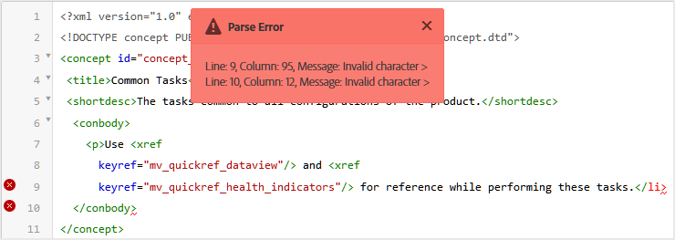

# Visualizzazioni editor per argomenti {#id204GK0D0V5Z}

L’interfaccia dell’editor in Adobe Experience Manager supporta la visualizzazione degli argomenti in tre diverse modalità o visualizzazioni:

* [Autore](#author)
* [Sorgente](#source)
* [Anteprima](#preview)

## Autore

**Visualizzazione tipica** \(WYSISYG\) dell&#39;editor. È possibile modificare l&#39;argomento come in qualsiasi normale editor Rich Text. Nella visualizzazione Autore sono disponibili le opzioni per salvare una revisione del documento, trovare e sostituire il contenuto, inserire un elemento, inserire un collegamento ipertestuale, inserire un riferimento al contenuto e altro ancora.

>[!NOTE]
>
> Quando utilizzi il riferimento al contenuto, il contenuto a cui si fa riferimento viene visualizzato anche nella vista Autore in blu. Il contenuto a cui si fa riferimento non è modificabile.

## Sorgente

Nella visualizzazione Source viene visualizzato il codice XML sottostante che costituisce l&#39;argomento. Se si ha familiarità con l&#39;utilizzo diretto di XML, è consigliabile utilizzare la visualizzazione Source. Oltre a eseguire modifiche regolari del testo in questa visualizzazione, è possibile aggiungere elementi e attributi utilizzando lo Smart Catalog oppure trovare e sostituire testo, elementi o attributi.

* Per richiamare lo Smart Catalog, posizionare il cursore alla fine di qualsiasi tag elemento nel punto in cui si desidera inserire il nuovo elemento e immettere &quot;&lt;&quot;. Nell&#39;editor viene visualizzato un elenco di tutti gli elementi XML validi che è possibile inserire in tale posizione. Utilizzare i tasti di direzione per selezionare l&#39;elemento che si desidera inserire e premere Invio. Quando si immette la parentesi quadra di chiusura &quot;\>, il tag di chiusura dell&#39;elemento viene aggiunto automaticamente.

  {width="400" align="left"}

* Puoi anche modificare facilmente un elemento dalla vista Source. Se ad esempio si modifica il tag di apertura di un elemento `p` in `note`, il tag di chiusura `p` verrà automaticamente modificato in `/note`. Se sostituisci un elemento con un elemento non corretto, viene immediatamente visualizzato l’Errore di convalida.

* Per aggiungere un attributo a un elemento, posizionare il cursore all&#39;interno del tag elemento e premere la barra spaziatrice. Un elenco di attributi validi per tale elemento viene visualizzato nello Smart Catalog. Utilizza i tasti freccia per selezionare l’elemento desiderato e premi Invio per inserirlo. Per specificare un valore per l&#39;attributo, immettere il segno di uguale \(=\) e l&#39;editor immette automaticamente le virgolette di apertura e chiusura &quot;&quot; in cui è possibile specificare il valore dell&#39;attributo.

  {width="350" align="left"}

* Nella vista Source è disponibile un&#39;opzione Rientro automatico che riorganizza il codice XML in un formato presentabile e facilmente leggibile. Inoltre, se si seleziona un testo e si passa dalla visualizzazione Autore a Source o dalla visualizzazione Source alla visualizzazione Autore, il testo selezionato viene evidenziato anche nell&#39;altra visualizzazione.
* Un&#39;altra caratteristica avanzata della vista Source è la convalida XML nel documento. Se si apre un documento contenente XML non valido, questo verrà aperto nella visualizzazione Source con le informazioni relative a XML non valido. Ad esempio, nella schermata seguente vengono fornite informazioni esatte sull&#39;XML errato nel pop-up Errore di analisi.

  {width="650" align="left"}

  Nella schermata precedente, viene utilizzata un’evidenziazione incrociata per puntare la riga contenente XML errato.

* La funzione Trova e sostituisci consente di cercare qualsiasi testo, elemento o attributo nella vista Source.
Per ulteriori dettagli, visualizzare la descrizione della funzionalità **Trova e sostituisci** nella sezione [Barra delle schede](web-editor-features.md#tab-bar).

* Nella visualizzazione Source sono disponibili numerose scelte rapide che consentono di spostarsi e lavorare rapidamente su un documento. Nella tabella seguente sono elencate le azioni supportate e i relativi tasti di scelta rapida:

  | Per eseguire questa operazione | Usa questa scelta rapida |
  |----------|-----------------|
  | Aggiungere più cursori | **Ctrl**+clic sinistro |
  | Più selezioni di testo non consecutive | **Ctrl**+clic con il pulsante sinistro del mouse per trascinare e selezionare il testo |
  | Seleziona testo su e tra le righe | **Alt**+clic con il pulsante sinistro del mouse per trascinare e selezionare il testo |
  | Annulla la selezione multipla o esci dalla modalità a schermo intero | **ESC** |
  | Mostra completamento automatico | **Ctrl**+**Spazio** |
  | Passa al tag di apertura o chiusura del tag corrente | **Ctrl**+**J** |
  | Espandere o comprimere il tag corrente e il relativo contenuto | **Ctrl**+**Q** |
  | Seleziona l’elemento corrente e il relativo contenuto | **Ctrl**+**L** |
  | Applicare un rientro negativo all&#39;elemento corrente | **Maiusc**+**Scheda** |
  | Elimina l’elemento corrente e il relativo contenuto | **Maiusc**+**Ctrl**+**K** |
  | Sposta il cursore di una parola a sinistra | **Alt**+**Freccia sinistra** |
  | Sposta il cursore di una parola verso destra | **Alt**+**Freccia Destra** |
  | Scorri di una riga verso l&#39;alto senza modificare la posizione del cursore | **Ctrl**+**Freccia Su** |
  | Scorri di una riga verso il basso senza modificare la posizione del cursore | **Ctrl**+**Freccia Giù** |
  | Attiva/disattiva schermo intero | **F11** |
  | Inserisci una nuova riga dopo l&#39;elemento corrente | **Ctrl**+**Invio** |
  | Inserisci una nuova riga prima dell&#39;elemento corrente | **MAIUSC**+**CTRL**+**INVIO** |
  | Trova e seleziona l&#39;occorrenza successiva della parola corrente | **Ctrl**+**D** |
  | Sposta l&#39;elemento corrente e il relativo contenuto di un elemento in alto | **Maiusc**+**Ctrl**+**Freccia Su** |
  | Sposta l&#39;elemento corrente e il relativo contenuto di un elemento verso il basso | **Maiusc**+**Ctrl**+**Freccia Giù** |
  | Racchiudi l’elemento corrente nel tag commento | **Ctrl**+**/** |
  | Duplica l’elemento corrente e il relativo contenuto | **Maiusc**+**Ctrl**+**D** |
  | Elimina il testo dopo il cursore. Se il cursore si trova prima di un elemento di apertura, l&#39;intero elemento viene eliminato. | **Ctrl**+**K**+**K** |
  | Elimina il testo a sinistra del cursore nella riga corrente. Se il cursore si trova dopo il tag di chiusura di un elemento, l&#39;intero elemento viene eliminato. | **Ctrl**+**K**+**Backspace** |
  | Converti il testo corrente in maiuscolo | **Ctrl**+**K**+**U** |
  | Converti il testo corrente in minuscolo | **Ctrl**+**K**+**L** |
  | Scorri l’elemento corrente fino al centro dell’editor | **Ctrl**+**K**+**C** |
  | Aggiungi un cursore sopra la posizione corrente | **Ctrl**+**Alt**+**Freccia Su** |
  | Aggiungi un cursore sotto la posizione corrente | **Ctrl**+**Alt**+**Freccia Giù** |
  | Trova in modo ricorsivo la parola corrente \(in avanti\) | **Ctrl**+**F3** |
  | Trova in modo ricorsivo la parola corrente \(in direzione indietro\) | **Maiusc**+**Ctrl**+**F3** |

## Anteprima

Quando si apre un argomento in modalità Anteprima, viene illustrato come verrà visualizzato un argomento quando viene visualizzato da un utente nel browser. Nel caso di una mappa DITA, viene visualizzata un&#39;anteprima della mappa in cui viene visualizzato un singolo documento composito di tutti gli argomenti all&#39;interno della mappa.

La modalità Anteprima offre le seguenti funzionalità:

* [Visualizzare il contenuto in base ai filtri condizionali](#id2114BI00VXA)
* [Visualizzare le revisioni delle revisioni](#id2114BJ00CE8)
* [Esportare un argomento come PDF](#id2114BL00B5U)

### Visualizzare il contenuto in base ai filtri condizionali {#id2114BI00VXA}

Se nell&#39;argomento o nella mappa sono state utilizzate condizioni, queste vengono visualizzate nel pannello Filtri. Per impostazione predefinita, vengono selezionate tutte le condizioni e viene visualizzato l’intero contenuto. Se deselezioni una condizione, il contenuto con tale condizione viene rimosso dalla visualizzazione. Puoi anche scegliere di evidenziare il contenuto condizionale.

Nell&#39;immagine seguente viene illustrato un argomento che utilizza due condizioni: `Audience` e `Product`. Il contenuto condizionale viene evidenziato con sfondo giallo.

{align="left"}

### Visualizzare le revisioni delle revisioni {#id2114BJ00CE8}

Se un documento contiene marcature di revisione \(o indicazioni visive\), è possibile anche visualizzare l&#39;anteprima del documento con o senza tali marcature. Durante l’anteprima di un documento, il pannello di destra contiene le opzioni Filtri e Tracciamento.

{width="400" align="left"}

È possibile scegliere tra tre opzioni di **tracciamento**:

* **Nessun markup**: in questa visualizzazione vengono accettati tutti gli inserimenti e le eliminazioni e viene presentata una semplice visualizzazione del documento. In questa visualizzazione non vengono visualizzate le revisioni.
* **Originale**: in questa visualizzazione, tutti gli inserimenti vengono rifiutati e tutte le eliminazioni ripristinate, quindi viene visualizzata un&#39;anteprima. È sufficiente ottenere il modulo originale del documento prima di attivare la modalità di rilevamento delle modifiche.
* **Mostra markup**: in questa visualizzazione vengono visualizzati tutti i markup per il contenuto inserito ed eliminato.

  L&#39;immagine seguente mostra l&#39;anteprima di un file di mappa con le marcature:

  {width="300" align="left"}

### Esportare un argomento come PDF {#id2114BL00B5U}

PDF è uno dei formati di output più comuni utilizzati in tutte le fasi possibili del ciclo di sviluppo dei documenti. Experience Manager Guides offre la flessibilità di generare il PDF di un singolo argomento o di un intero file di mappa. La funzione Esporta come PDF consente all’autore, al publisher o all’amministratore di generare facilmente l’output di PDF per un singolo argomento. Utilizza le configurazioni DITA-OT salvate nel profilo a livello di cartella per generare il PDF.

Questa funzione supporta le seguenti funzionalità:

* Genera il PDF della copia di lavoro attiva di un argomento.
* Accettare il nome della trasformazione DITA-OT e gli argomenti della riga di comando per generare il PDF.
* Salva l&#39;output generato nel sistema locale.
* Risolvi i riferimenti a chiave e contenuto utilizzati nell’argomento prima di generare l’output.

Per esportare un argomento come PDF, eseguire la procedura seguente:

1. Aprire l&#39;argomento in modalità Anteprima. Verificare che l&#39;argomento sia incluso in un file di mapping.

1. Selezionare l&#39;opzione **Scarica come PDF** nella parte superiore.

   Icona .

   >[!NOTE]
   >
   > Assicurati di aver attivato la finestra pop-up nella configurazione del browser, altrimenti il PDF non verrà scaricato.

   Il PDF viene generato e aperto in una nuova scheda oppure viene visualizzata una finestra di dialogo per salvare il PDF nel sistema locale.

**Argomento padre:**[ Introduzione all&#39;editor](web-editor.md)
