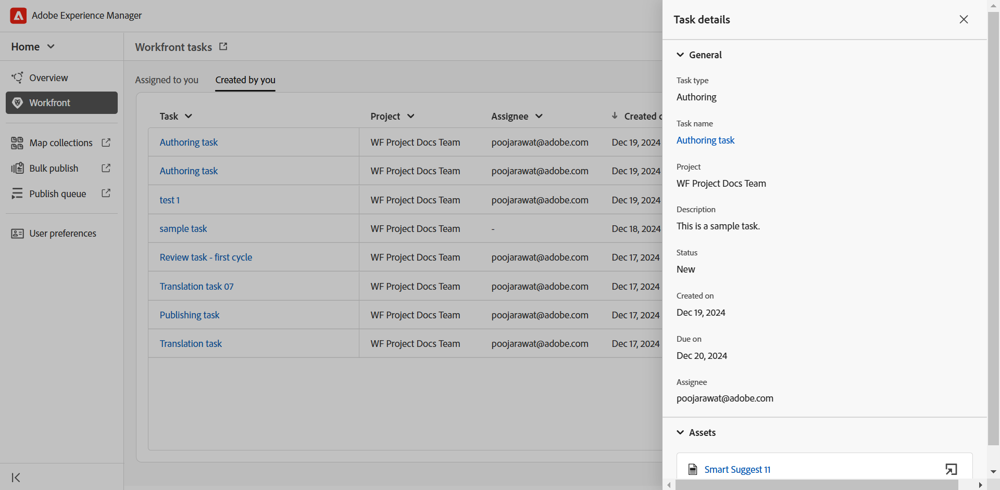
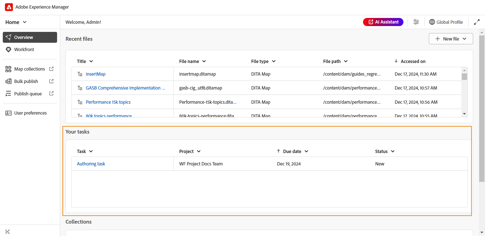
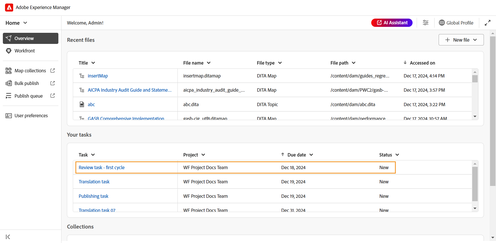
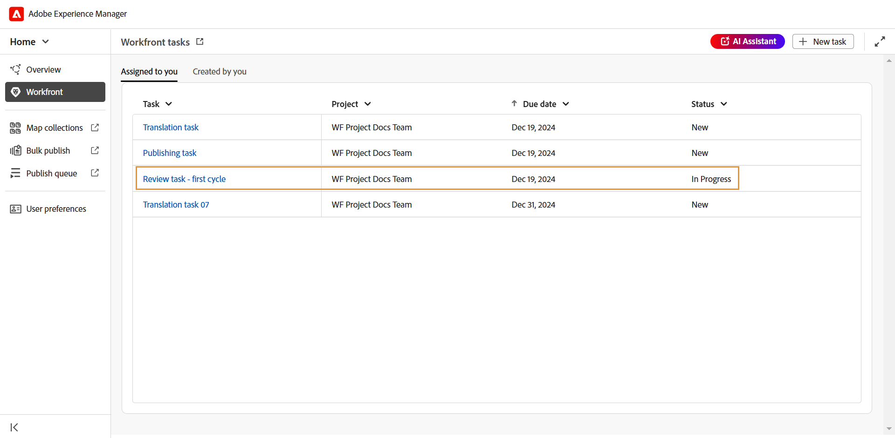
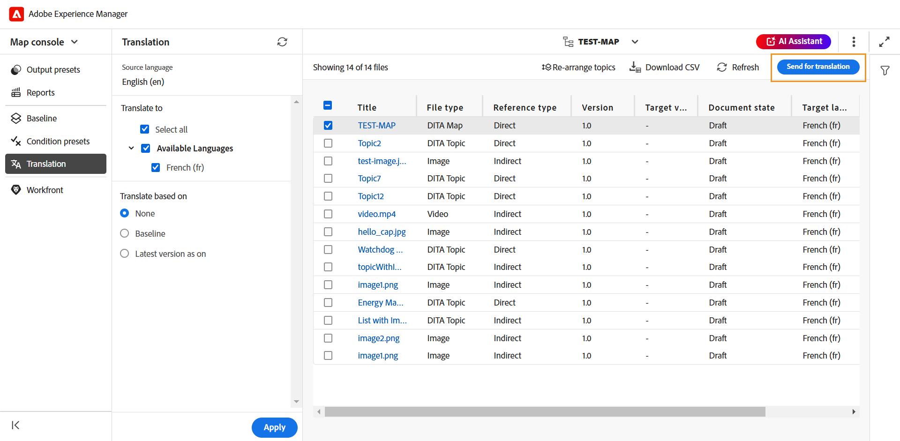

# Integrazione di Workfront

Adobe Workfront è una soluzione di gestione del lavoro basata su cloud che consente a team e organizzazioni di pianificare, monitorare e gestire il proprio lavoro in modo efficiente. L’integrazione tra Experience Manager Guides e Adobe Workfront consente di accedere a solide funzionalità di gestione dei progetti oltre alle funzionalità principali di Experience Manager Guides CCMS, che consentono di pianificare, allocare e tenere traccia delle attività in modo efficiente.

Con questa integrazione, puoi creare e gestire attività di Adobe Workfront direttamente da Experience Manager Guides. Come autore, ad esempio, è possibile creare un&#39;attività di revisione (con uno o più argomenti o mappe DITA aggiunti) direttamente all&#39;interno dell&#39;interfaccia di Experience Manager Guides e assegnarla a un revisore. In qualità di revisore, puoi lavorare sulle attività assegnate nell’interfaccia utente Revisione di Experience Manager Guides e restituirle all’autore con i relativi commenti. Allo stesso modo, puoi creare un’attività di pubblicazione e traduzione e quindi assegnarla agli utenti che devono lavorarci.

L’integrazione consente inoltre di monitorare le code di lavoro, assicurandoti di rimanere organizzato e al di sopra di tutte le attività (attività assegnate).

**Funzioni chiave**

Con l’integrazione di Experience Manager Guides e Adobe Workfront, puoi:

* Pianificare, allocare e tenere traccia dell&#39;avanzamento di singole attività e progetti senza ricorrere a più strumenti non integrati.
* Gestisci tutti i flussi di lavoro di Experience Manager Guides, inclusi authoring, revisione, pubblicazione e traduzione dei contenuti in modo più efficiente.
* Ricevi notifiche e-mail da Adobe Workfront ogni volta che vengono assegnate nuove attività. Per ulteriori dettagli, visualizzare [Panoramica notifiche](https://experienceleague.adobe.com/it/docs/workfront/using/basics/use-notifications/wf-notifications).
* Monitora lo stato del progetto utilizzando la dashboard intuitiva di Adobe Workfront, che offre informazioni in tempo reale sulle prestazioni del progetto.

  Per informazioni sulle solide funzionalità di gestione dei progetti di Adobe Workfront abilitate per i project manager in Experience Manager Guides, visualizza [Panoramica del progetto](https://experienceleague.adobe.com/it/docs/workfront/using/manage-work/projects/plan-a-project/plan-project).

## Introduzione

Una volta configurate e abilitate dall&#39;amministratore, le attività di Adobe Workfront sono accessibili direttamente dalla [home page di Experience Manager Guides](./intro-home-page.md).

Per accedere alle attività di Adobe Workfront, effettua le seguenti operazioni:

1. Accedi a Experience Manager Guides e apri la **home page**.
2. Nel pannello a sinistra, seleziona **Workfront**.

   Viene visualizzata la pagina **Attività di Workfront**.

   {align="left"}
3. Seleziona **Accedi**.

   Ti reindirizzano alla pagina di accesso di Adobe Workfront.
4. Accedi utilizzando lo stesso indirizzo di posta elettronica utilizzato in Experience Manager Guides, quindi seleziona **Consenti accesso** per consentire all&#39;applicazione di accedere al tuo account Adobe Workfront.

   Viene automaticamente reindirizzato alla pagina **Attività Workfront** in Experience Manager Guides.

   {align="left"}

## Funzioni disponibili nella pagina Attività di Workfront

Nella pagina Attività di Workfront sono disponibili le seguenti funzioni:

* [Nuova attività](#create-workfront-tasks): consente di creare attività di Adobe Workfront direttamente dall&#39;interfaccia di Experience Manager Guides.
* [Assegnato a te](#managing-tasks-assigned-to-you): elenca tutte le attività assegnate a te e ancora attive.
* [Creato da te](#managing-tasks-created-by-you): elenca tutte le attività che hai creato e che sono ancora attive.

La pagina Attività di Workfront include anche l&#39;icona di collegamento  che, se selezionata, consente di accedere alla pagina del progetto Adobe Workfront. Qui puoi visualizzare i dettagli delle attività, visualizzare i commenti, aggiungere commenti e accedere ad altre funzioni in base alle autorizzazioni mappate con il tuo account Adobe Workfront.

Per ulteriori dettagli, visualizza [Panoramica delle date di Progetto, Attività e Problema in Workfront](https://experienceleague.adobe.com/it/docs/workfront/using/basics/navigate/definitions-pti-dates).

### Creare attività di Workfront

Puoi creare le attività di Adobe Workfront direttamente dall&#39;interfaccia di Experience Manager Guides utilizzando il pulsante **Nuova attività** presente nella pagina Attività di Workfront.

Per creare una nuova attività Adobe Workfront, effettua le seguenti operazioni:

1. Nella pagina Attività di Workfront, seleziona **Nuova attività**.

   Viene visualizzata la finestra di dialogo **Crea attività**.

   {align="left"}
2. Nella scheda **Generale**, immettere i dettagli dell&#39;attività seguenti:

   * **Tipo di attività**: selezionare il tipo di attività da creare. Le opzioni disponibili sono: **Authoring**, **Revisione**, **Pubblicazione** e **Traduzione**.
   * **Progetto**: selezionare il progetto in cui si desidera creare l&#39;attività.
   * **Nome attività**: immettere un nome descrittivo per l&#39;attività.
   * **Descrizione**: immettere una breve descrizione dell&#39;attività.
   * **Scadenza**: impostare la data di scadenza per il completamento dell&#39;attività.
   * **Assegnatario**: selezionare un assegnatario per l&#39;attività.
3. Nella scheda **Assets**, seleziona **Aggiungi** per aggiungere una risorsa a questa attività.

   {align="left"}

   Viene visualizzata la finestra di dialogo **Seleziona percorso**. Seleziona un percorso per la risorsa richiesta. Per aggiungere più risorse, seleziona i percorsi validi nel browser percorsi. I percorsi selezionati verranno mantenuti e potranno essere esaminati o modificati facilmente quando riapri la finestra di dialogo.

   * Per le attività di authoring, pubblicazione e traduzione, viene richiesto di selezionare il percorso del file richiesto nella finestra di dialogo **Seleziona file**. Il file selezionato (un argomento per la creazione e la mappatura per la pubblicazione e la traduzione) viene aggiunto all&#39;attività non appena viene selezionato il pulsante **Crea**.

     {align="left"}

   * Per le attività di revisione, viene richiesto di selezionare il tipo di risorsa (Mappa o Argomenti), quindi i file selezionati vengono visualizzati come segue:

     {align="left"}

     *Aggiunta di argomenti a un&#39;attività di revisione*

     {align="left"}

     *Aggiunta di mappe a un&#39;attività di revisione*

     Per modificare la selezione prima di inviare per la revisione, sono disponibili le azioni seguenti:

      * Deseleziona alcuni argomenti dall’elenco.
      * Filtrare l&#39;elenco degli argomenti in base allo stato del documento.
      * Modifica o imposta la versione degli argomenti selezionati su **Ultima versione**, **Versione in base alle date** e **Previsione** (disponibile solo per le mappe) in base alle esigenze.

     Per ulteriori dettagli, visualizzare [invia argomenti per la revisione](./review-send-topics-for-review.md).

   >[!NOTE]
   >
   > L’aggiunta di una risorsa a un’attività consente agli assegnatari di accedere rapidamente a un argomento, una mappa o a qualsiasi altro file su cui devono lavorare. Per le attività di authoring, pubblicazione e traduzione, l’aggiunta di una risorsa è facoltativa ma può essere utile per semplificare i flussi di lavoro. Tuttavia, per le attività di revisione, l’aggiunta di una risorsa è obbligatoria.

4. Seleziona **Crea**.

Una nuova attività viene creata ed elencata nella scheda **Creato da te**.

>[!NOTE]
>
> In qualità di project manager, puoi visualizzare questa nuova attività nel dashboard di Adobe Workfront insieme ad altri dettagli chiave sull’attività. Per ulteriori dettagli, visualizzare [Comprendere le dashboard](https://experienceleague.adobe.com/it/docs/workfront/using/reporting/dashboards/understand-dashboards/understand-dashboards).

### Gestione delle attività create dall&#39;utente

Tutte le attività create e ancora attive vengono visualizzate nella scheda **Creato da te** della pagina Attività di Workfront, fornendo dettagli chiave come il nome del progetto, gli assegnatari, la data di creazione dell&#39;attività, la data di completamento dell&#39;attività e lo stato dell&#39;attività.

{align="left"}

Quando passi il cursore su un’attività presente nella scheda Creato da te, sono disponibili le seguenti opzioni:

**Apri** - 

Consente di aprire l&#39;attività. A seconda del tipo di attività, si aprirà nell’editor, nella console Mappa o nell’interfaccia utente Revisione.

**Modifica** - 

Consente di modificare i dettagli dell&#39;attività aggiunti durante la creazione dell&#39;attività. Tutti i campi sono modificabili ad eccezione di Tipo di attività e Progetto. È possibile modificare solo le attività create dall&#39;utente. Impossibile modificare le attività assegnate.

Inoltre, puoi aggiungere o rimuovere risorse quando modifichi un’attività di authoring, pubblicazione o traduzione. Tuttavia, per un’attività di revisione, è possibile modificare solo la versione delle risorse inviate per la revisione.

**Dettagli attività** - 

Visualizza le informazioni sull&#39;attività, inclusi i dettagli immessi durante la creazione dell&#39;attività, lo stato dell&#39;attività ed eventuali risorse aggiunte.

### Gestione delle attività assegnate a te

Tutte le attività assegnate all&#39;utente e ancora attive vengono visualizzate nella scheda **Assegnate all&#39;utente** della pagina Attività di Workfront, fornendo dettagli chiave come il nome del progetto, gli assegnatari, la data di scadenza e lo stato dell&#39;attività.

{align="left"}

Quando passi il cursore su un’attività presente nella scheda Assegnato a te, sono disponibili le seguenti opzioni:

**Apri** - 

Consente di aprire l&#39;attività. A seconda del tipo di attività, si aprirà nell’editor, nella console Mappa o nell’interfaccia utente Revisione.

**Dettagli attività** - 

Visualizza le informazioni sull&#39;attività, inclusi i dettagli immessi durante la creazione dell&#39;attività, lo stato dell&#39;attività ed eventuali risorse aggiunte.

{align="left"}

#### Accesso alle attività assegnate dalla sezione Panoramica

Puoi anche accedere alle attività Adobe Workfront assegnate dalla [sezione Panoramica](./intro-home-page.md#overview). La sezione Panoramica, se selezionata, presenta diversi widget che consentono di rimanere concentrati e organizzati.

**Le attività** sono uno di questi widget in cui viene visualizzato un elenco di attività di Adobe Workfront (che sono assegnate all&#39;utente e sono ancora attive) insieme ai dettagli dell&#39;attività chiave, tra cui il nome dell&#39;attività, il progetto associato, la data di scadenza e lo stato corrente.

{align="left"}

Analogamente alla scheda Assegnato a te, il widget Attività fornisce anche le opzioni per **Apri** e visualizzare **Dettagli attività** quando passi il cursore su un&#39;attività.

Il widget fornisce inoltre opzioni per ordinare e ridimensionare le colonne per una vista personalizzata. Per applicare l’ordinamento a una colonna, seleziona l’intestazione della colonna e le opzioni vengono visualizzate in un elenco. Per regolare la larghezza di una colonna, posiziona il cursore del mouse sulla linea del divisore di colonna nell’intestazione, quindi trascina per ridimensionarla.

>[!NOTE]
>
> Quando non sei presente nell’interfaccia di Experience Manager Guides, ricevi una notifica e-mail da Adobe Workfront per qualsiasi nuova attività assegnata. Per estrarre queste attività, accedi all’istanza di Experience Manager Guides e accedi alle attività assegnate.

## Utilizzo delle attività assegnate ad Adobe Workfront

È possibile creare e quindi assegnare o lavorare su quattro tipi di attività di Adobe Workfront, se assegnate in Experience Manager Guides:

1. [Authoring delle attività](#authoring-tasks)
2. [Attività di revisione](#review-tasks)
3. [Attività di traduzione](#translation-tasks)
4. [Pubblicazione delle attività](#publishing-tasks)

Le sezioni seguenti descrivono nel dettaglio il processo di lavoro sulle attività di Adobe Workfront assegnate.

### Authoring delle attività

Per lavorare su un’attività di authoring, effettua le seguenti operazioni:

1. Accedi all&#39;attività dalla sezione [Panoramica](#accessing-assigned-tasks-from-overview-section) o dalla scheda [Assegnato](#managing-tasks-assigned-to-you).

   {align="left"}

   *Attività di authoring nella scheda Assegnato a te*

   {align="left"}

   *Authoring dell&#39;attività nel widget Attività*
2. Passa il cursore del mouse sull’attività su cui desideri lavorare e seleziona    per aprirlo. È inoltre possibile aprire l&#39;attività selezionando semplicemente l&#39;attività.

   Tutte le attività di authoring vengono aperte nell&#39;editor.
3. Rivedi i dettagli dell&#39;attività nella scheda **Dettagli** e seleziona il file **Risorsa** per aprirlo.

   {align="left"}

4. Apporta le modifiche necessarie e seleziona **Contrassegna come completato**.
5. Passa alla scheda **Commenti** per aggiungere un commento a questa attività. Questi commenti, aggiunti a livello di attività, si rifletteranno anche sulla dashboard del progetto Adobe Workfront.

   >[!NOTE]
   >
   > Una volta contrassegnata come completata, l&#39;attività verrà rimossa sia dall&#39;elenco delle attività assegnate che dall&#39;elenco delle attività **create dall&#39;iniziatore dell&#39;attività**.

### Attività di revisione

In qualità di revisore, puoi rivedere le attività di revisione di Adobe Workfront che ti sono state assegnate.

Per lavorare su un&#39;attività di revisione a te assegnata, effettua le seguenti operazioni.

1. Accedi all&#39;attività dalla sezione [Panoramica](#accessing-assigned-tasks-from-overview-section) o dalla scheda [Assegnato](#managing-tasks-assigned-to-you).

   {align="left"}

   *Attività di revisione nella scheda Assegnato a te*

   {align="left"}

   *Authoring dell&#39;attività nel widget Attività*
2. Passa il cursore del mouse sull’attività su cui desideri lavorare e seleziona    per aprirlo. È inoltre possibile aprire l&#39;attività selezionando semplicemente l&#39;attività.

   Per i revisori, l&#39;attività di revisione si apre nella **interfaccia utente di revisione**.

   {align="left"}

3. Esegui la revisione richiesta. Per informazioni dettagliate su come rivedere un argomento, visualizzare [argomenti di revisione](./review-topics.md).
4. Al termine della revisione, selezionare **Contrassegna come completato**.
5. Passa alla scheda **Commenti** per aggiungere un commento a questa attività. Questi commenti, aggiunti a livello di attività, si rifletteranno anche sulla dashboard del progetto Adobe Workfront.

Contrassegnare l&#39;attività come completata dal revisore non indica il completamento dell&#39;attività. Tutte le attività di revisione vengono riassegnate all&#39;utente che l&#39;ha creata (idealmente un autore che ha richiesto una revisione).

>[!NOTE]
>
> Se l&#39;attività è assegnata a più revisori, viene riassegnata all&#39;autore dell&#39;attività solo dopo che tutti i revisori l&#39;hanno contrassegnata come completata.

Le attività di revisione riassegnate al creatore/agli autori per l&#39;incorporazione della revisione, sono accessibili dalla sezione [Panoramica](#accessing-assigned-tasks-from-overview-section) o dalla scheda [Assegnato a te](#managing-tasks-assigned-to-you).

{align="left"}

*Attività di revisione riassegnata agli autori*

Per queste attività, lo stato dell&#39;attività per l&#39;assegnatario diventa **Authoring** mentre il tipo dell&#39;attività rimane **Revisione**. Questo cambiamento di stato si verifica quando la revisione viene completata da tutti i revisori.

{align="left"}

Se si seleziona l&#39;attività o l&#39;icona Apri , l&#39;attività verrà aperta nell&#39;editor in cui l&#39;autore potrà [indirizzare i commenti di revisione](../user-guide/review-address-review-comments.md), modificare l&#39;attività aggiornando la versione degli argomenti, quindi riassegnare l&#39;attività al revisore, se necessario.

L’autore può anche modificare l’attività e assegnarla a un altro autore, delegando l’attività di incorporazione dei commenti. A tale scopo, selezionare **Modifica**, cambiare lo stato dell&#39;attività in **Authoring**, quindi selezionare **Cambia assegnatario**. Ora puoi selezionare un assegnatario dall’elenco.

Questo processo forma un ciclo continuo, in cui l&#39;attività si sposta avanti e indietro tra l&#39;autore e il revisore fino a quando non è completamente completata. Dopo aver incorporato tutte le modifiche suggerite, l&#39;autore può completare l&#39;attività selezionando **Contrassegna come completata**.

### Attività di traduzione

Puoi eseguire varie azioni di traduzione sulle attività di traduzione Adobe Workfront che ti sono assegnate.

Per lavorare su un’attività di traduzione, effettua le seguenti operazioni:

1. Accedi all&#39;attività dalla sezione [Panoramica](#accessing-assigned-tasks-from-overview-section) o dalla scheda [Assegnato](#managing-tasks-assigned-to-you).

   {align="left"}

   *Attività di traduzione nella scheda Assegnato a te*

   {align="left"}

   *Attività di traduzione nel widget Attività*

2. Passa il cursore del mouse sull’attività su cui desideri lavorare e seleziona    per aprirla nella **console Mappa**. È inoltre possibile aprire l&#39;attività selezionando semplicemente l&#39;attività.
3. Rivedi i dettagli dell’attività e il file aggiunto per la traduzione.

   {align="left"}
4. Passa alla scheda **Traduzione** per le varie opzioni di traduzione. Scopri come [tradurre il contenuto](../user-guide/translation.md) in Experience Manager Guides.
5. Esegui la traduzione richiesta e seleziona **Invia per la traduzione**.
   {align="left"}
6. Passare alla sezione **Workfront** e selezionare **Contrassegna come completato** per indicare che l&#39;attività è stata completata.
7. Passa alla scheda **Commenti** per aggiungere un commento a questa attività. Questi commenti, aggiunti a livello di attività, si rifletteranno sul dashboard del progetto Adobe Workfront.

   >[!NOTE]
   >
   > Una volta contrassegnata come completata, l&#39;attività verrà rimossa sia dall&#39;elenco delle attività assegnate che dall&#39;elenco delle attività **create dall&#39;iniziatore dell&#39;attività**.

### Pubblicazione delle attività

In qualità di editore, puoi visualizzare i dettagli e pubblicare un’attività di pubblicazione che ti è stata assegnata.

Per lavorare su un’attività di pubblicazione, effettua le seguenti operazioni:

1. Accedi all&#39;attività dalla sezione [Panoramica](#accessing-assigned-tasks-from-overview-section) o dalla scheda [Assegnato](#managing-tasks-assigned-to-you).

   {align="left"}

   *Attività di pubblicazione nella scheda Assegnato a te*

   {align="left"}

   *Pubblicazione dell&#39;attività nel widget Attività*
2. Passa il cursore del mouse sull’attività su cui desideri lavorare e seleziona    per aprirla nella **console Mappa**. È inoltre possibile aprire l&#39;attività selezionando semplicemente l&#39;attività.
3. Rivedi i dettagli dell’attività e il file aggiunto per la pubblicazione.

   {align="left"}
4. Passa a **Predefiniti di output** ed esegui le azioni di pubblicazione necessarie per pubblicare l&#39;attività. Per ulteriori dettagli, visualizzare [Informazioni sui predefiniti di output](../user-guide/generate-output-understand-presets.md).
5. Al termine della pubblicazione, passare alla sezione **Workfront** e selezionare **Contrassegna come completato** per indicare che l&#39;attività è stata completata.
6. Passa alla scheda **Commenti** per aggiungere un commento a questa attività. Questi commenti, aggiunti a livello di attività, si rifletteranno sul dashboard dei progetti di Workfront.

   >[!NOTE]
   >
   > Una volta contrassegnata come completata, l&#39;attività verrà rimossa sia dall&#39;elenco delle attività assegnate che dall&#39;elenco delle attività **create dall&#39;iniziatore dell&#39;attività**.
