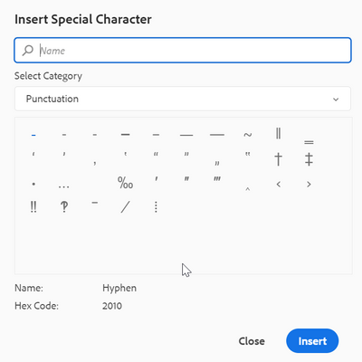

# Come configurare caratteri speciali aggiuntivi nella barra degli strumenti dell’editor Web

Nella barra degli strumenti dell’editor web è disponibile un’opzione di scelta rapida che consente all’autore di inserire già i caratteri speciali.
Lo stesso può essere visto nella schermata seguente:




L’elenco dei caratteri è configurabile qui. Per aggiungere altri caratteri, effettua le seguenti operazioni:

+ Accedi all’AEM e apri la modalità CRXDE Liti.

+ Crea il file symbols.json nella posizione seguente: &#39;/apps/fmdita/xmleditor/&#39; (puoi copiare il file predefinito da - posizione &#39;/libs/fmdita/clientlibs/clientlibs/xmleditor/symbols.json&#39;)

+ Aggiungi la definizione del carattere speciale nel file symbols.json come:

```
{
      "label": "Logical Symbols",
      "items": [
        {
          "name": "≥",
          "title": "Greater-Than or Equal To"
        },
        {
          "name": "≤",
          "title": "Smaller-Than or Equal To"
        }
      ]
}
```

La struttura del file symbols.json è spiegata di seguito:

+ &quot;label&quot;: &quot;Logical Symbols&quot;: specifica la categoria dei caratteri speciali. Nel frammento è definita una categoria denominata &quot;Simbolo logico&quot;.

+ &quot;items&quot; (elementi): definisce la raccolta di caratteri speciali nella categoria.

+ &quot;name&quot;: &quot;≥&quot;, &quot;title&quot;: &quot;Greater-Than or Equal To&quot;: questa è la definizione del carattere speciale. Inizia con l&#39;etichetta &quot;name&quot;, che non deve essere modificata. Il nome è seguito dal carattere speciale. Il &quot;titolo&quot; è il nome o il titolo del carattere speciale che viene visualizzato come descrizione comando del carattere speciale.

All’interno di una categoria è possibile definire più definizioni di caratteri speciali.

Verrà aggiunta un’altra categoria nella finestra di dialogo dei caratteri speciali:


>[!MORELIKETHIS]
>
>+ [Guida all’installazione e alla configurazione](https://helpx.adobe.com/content/dam/help/en/xml-documentation-solution/3-6/XML-Documentation-for-Adobe-Experience-Manager_Installation-Configuration-Guide_EN.pdf)
