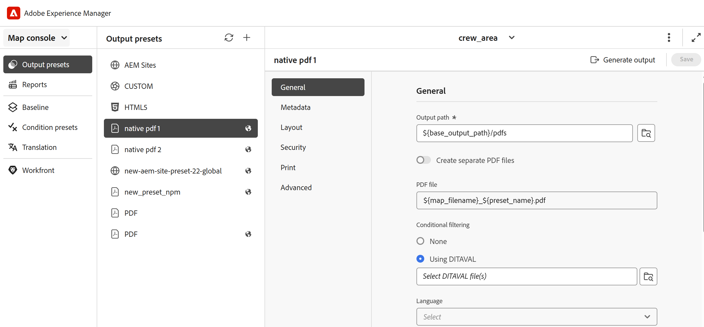

# Predefinito di uscita PDF nativa

Durante l’authoring dei contenuti, è fondamentale assicurarsi che siano ottimizzati per la visualizzazione, la modifica e la stampa. Utilizzando gli standard W3C CSS3 per lo stile dei contenuti e gli standard CSS per i file multimediali di paging per le proprietà di definizione delle pagine, quali dimensioni, margini, orientamento, interruzioni di pagina, intestazioni, piè di pagina e numerazione delle pagine, è possibile impostare la visualizzazione e il layout per il documento PDF, garantendo coerenza e usabilità. La funzione di pubblicazione nativa di PDF utilizza questi standard per generare un PDF.

Con la pubblicazione nativa di PDF, puoi utilizzare modelli predefiniti per garantire la coerenza nel layout e nella struttura dei contenuti, applicare fogli di stile per modificare l’aspetto dell’output, ottimizzare PDF, impostare gli indicatori della stampante, consentire il supporto di utilità per la lettura dello schermo, impostare la conformità PDF, i font da incorporare e molto altro.

La generazione di un PDF mediante la pubblicazione nativa di PDF presenta due aspetti:

* Utilizzo di modelli per applicare lo stile ai contenuti, impostare i layout di pagina e varie impostazioni per ottimizzare il PDF. Gli autori possono scegliere di utilizzare/modificare i modelli di esempio forniti o creare modelli personalizzati e impostare opzioni di configurazione avanzate utilizzate da autori e sviluppatori.

* Crea o configura un predefinito di output PDF per controllare le impostazioni del PDF. Una volta creato un predefinito di output PDF, puoi generare il PDF.

## Creare un predefinito di output

Per creare il predefinito PDF dalla console Mappa, effettua le seguenti operazioni:

1. [Aprire un file mappa DITA nella console Mappa](../user-guide/open-files-map-console.md).

   Puoi anche accedere al file mappa dal widget **File recenti** nella [sezione Panoramica](../user-guide/intro-home-page.md#overview). Il file di mappa selezionato viene aperto nella console Mappa.
1. Nella scheda **Predefiniti di output**, seleziona l&#39;icona + per creare un predefinito di output.
1. Selezionare **PDF** dal menu a discesa Tipo nella finestra di dialogo **Nuovo predefinito di output**.
1. Nel campo **Name**, specifica un nome per questo predefinito.
1. Nel campo **Genera PDF utilizzando**, selezionare **Native-PDF**.
1. Selezionare l&#39;opzione **Aggiungi al profilo cartella corrente** per creare un predefinito di output nel profilo cartella corrente. L&#39;icona  indica un predefinito a livello di profilo della cartella.

   Ulteriori informazioni su [Gestire i predefiniti di output per profili globali e cartelle](../user-guide/web-editor-manage-output-presets.md).

1. Seleziona **Aggiungi**.

   Viene creato il predefinito per PDF.

## Configurazione predefinita PDF nativa

Una volta creato il predefinito, configura le impostazioni del predefinito PDF nativo. Le opzioni di configurazione predefinite per DITA-OT sono organizzate nelle schede **Generale**, **Metadati**, **Layout**, **Sicurezza**, **Stampa** e **Avanzate**.

**Generale**

Consente di specificare le impostazioni di output di base, ad esempio il percorso di output, il nome del file PDF e altro ancora.

| Impostazione | Descrizione |
| --- | --- |
| **Percorso di output** | Percorso all’interno dell’archivio AEM in cui è memorizzato l’output PDF. Assicurati che il percorso di output non si trovi all’interno della cartella del progetto. Il percorso di output è impostato tramite la variabile `${base_output_path}`, configurata dall&#39;amministratore. Per configurare il percorso di output, visualizzare [Configurare il percorso di output di base per i servizi cloud](../native-pdf/configure-base-location-cs.md) o [Configurare il percorso di output di base per i servizi locali](../native-pdf/configure-base-output-location.md) in base al servizio in uso.  Per definire il percorso di output è inoltre possibile utilizzare le seguenti variabili predefinite. Puoi utilizzare una singola variabile o una combinazione di variabili per definire questa opzione.   `${map_filename}`: utilizza il nome dei file di mapping DITA per creare il percorso di destinazione.   `${map_title}`: utilizza il titolo della mappa DITA per creare il percorso di destinazione.  `${preset_name}`: usa il nome del predefinito di output per creare il percorso di destinazione.   `${language_code}`: utilizza il codice della lingua in cui si trova il file di mappa per creare il percorso di destinazione.   `${map_parentpath}`: utilizza il percorso completo del file di mappa per creare il percorso di destinazione.   `${path_after_langfolder}`: utilizza il percorso del file di mappa dopo la cartella della lingua per creare il percorso di destinazione. |
| **File PDF** | Specificare un nome di file per il salvataggio del PDF. Per impostazione predefinita, il nome del file PDF aggiunge il nome della mappa DITA insieme al nome del predefinito. Ad esempio, ditamap è &quot;TestMap&quot; e il nome del predefinito è &quot;preset1&quot;; il nome predefinito del pdf sarà &quot;TestMap_preset1.pdf&quot;.  Per definire il file PDF è inoltre possibile utilizzare le seguenti variabili predefinite. Puoi utilizzare una singola variabile o una combinazione di variabili per definire questa opzione.  `${map_filename}` `${map_title}` `${preset_name}`   `${language_code}`. |
| **Applica condizioni utilizzando** | Per il contenuto condizionale, scegliere tra le opzioni seguenti per generare un output PDF in base a tali condizioni:  <ul> <li> **Nessuna applicazione** Selezionare questa opzione se non si desidera applicare alcuna condizione alla mappa e al contenuto di origine.  <li> **File DITAVAL** Selezionare un file DITAVAL per generare contenuto condizionale. È possibile selezionare più file DITAVAL utilizzando la finestra di dialogo Sfoglia o immettendo manualmente il percorso del file. Per rimuovere un file selezionato, fare clic sull&#39;icona a forma di croce accanto al nome del file. Se viene selezionato un file non valido, viene visualizzato un messaggio di errore che indica che **è selezionato un file DITAVAL non valido**.    Ogni file DITAVAL può contenere una serie di proprietà, ad esempio condizioni di filtro e stili di contrassegno. I contrassegni consentono di contrassegnare visivamente il contenuto utilizzando i contrassegni di inizio e di fine, che possono includere immagini o formattazione del testo come il grassetto o il corsivo. In caso di condizioni di sovrapposizione o conflitti di stile, potete definire un colore di sfondo utilizzando le impostazioni dei conflitti di stile. Per ulteriori dettagli, visualizzare [Utilizzare l&#39;editor DITAVAL](../user-guide/ditaval-editor.md). <li> **Predefinito condizione** Seleziona un predefinito condizione dall&#39;elenco a discesa per applicare una condizione durante la pubblicazione dell&#39;output. Questa opzione è visibile se è stata aggiunta una condizione per il file di mapping DITA. Le impostazioni condizionali sono disponibili nella scheda Predefiniti condizione della console delle mappe DITA. Per ulteriori informazioni sul predefinito di condizione, visualizzare [Usa predefiniti di condizione](https://help.adobe.com/en_US/xml-documentation-for-adobe-experience-manager/index.html#t=DXML-master-map%2Fgenerate-output-use-condition-presets.html).   </ul> |
| **Usa Base Line** | Se è stata creata una baseline per la mappa DITA selezionata, selezionare questa opzione per specificare la versione da pubblicare. Visualizza [Lavora con la linea di base](https://help.adobe.com/en_US/xml-documentation-for-adobe-experience-manager/index.html#t=DXML-master-map%2Fgenerate-output-use-baseline-for-publishing.html) per ulteriori dettagli. |
| **Crea PDF con barra di modifica tra le versioni pubblicate** | Utilizza le seguenti opzioni per creare un PDF che mostri le differenze di contenuto tra due versioni utilizzando le barre di modifica:    <ul><li> **Baseline della versione precedente** Scegliere la versione della baseline da confrontare con la versione corrente o con un&#39;altra baseline. In PDF viene visualizzata una barra delle modifiche che indica il contenuto modificato. Una barra delle modifiche è una linea verticale che identifica visivamente il contenuto nuovo o rivisto. La barra delle modifiche viene visualizzata a sinistra del contenuto inserito, modificato o eliminato.   **Nota**: se si seleziona **Usa baseline** e si sceglie una baseline da pubblicare, il confronto verrà eseguito tra le due versioni della baseline selezionate. Ad esempio, se si sceglie la versione 1.3 della baseline in **Usa la baseline** e la versione 1.1 in **Baseline della versione precedente**, verrà eseguito il confronto tra la versione 1.1 della baseline e la versione 1.3 della baseline.  <li> **Mostra testo aggiunto** Seleziona questa opzione per mostrare il testo inserito in verde e sottolineato. Questa opzione è selezionata per impostazione predefinita.   <li> **Mostra testo eliminato** Selezionare questa opzione per visualizzare il testo eliminato in rosso e contrassegnato con un barrato. Questa opzione è selezionata per impostazione predefinita.  **Nota** È inoltre possibile personalizzare lo stile della barra delle modifiche, del contenuto inserito o del contenuto eliminato utilizzando il foglio di stile. </ul> |
| **Flusso di lavoro di post-generazione** | Seleziona questa opzione per visualizzare un elenco a discesa contenente tutti i flussi di lavoro configurati in AEM. Puoi selezionare il flusso di lavoro da eseguire dopo il completamento del flusso di lavoro di generazione PDF. |

**Metadati**

I metadati sono la descrizione o la definizione del contenuto. I metadati sono utili per la gestione dei contenuti e per la ricerca di file su Internet.

Utilizzare la scheda Metadati per impostare i campi metadati, ad esempio il nome dell&#39;autore, il titolo del documento, le parole chiave, le informazioni sul copyright e altri campi dati per l&#39;output di PDF. Puoi anche aggiungere metadati personalizzati per l’output PDF.

Questi metadati sono mappati ai metadati nella scheda **Descrizione** all&#39;interno delle **Proprietà documento** del PDF di output.

Dai predefiniti di output, seleziona **PDF** > **Native-PDF** > **Metadati** per aggiungere e personalizzare le opzioni dei metadati.
* **Usa metadati aggiunti in topicmeta**

  Questa opzione è selezionata per impostazione predefinita. È possibile utilizzare i metadati aggiunti nell&#39;elemento topicmeta della mappa DITA per popolare i campi metadati dell&#39;output PDF.

* **Fornisci file XMP**

  Puoi anche compilare direttamente i campi di metadati importando il file [XMP](https://www.adobe.com/products/xmp.html) (Extensible Metadata Platform). Puoi scaricare un file XMP di esempio da qui.

[Scarica](assets/SampleXMP.xmp)

  In alternativa, puoi generare un file XMP utilizzando Adobe Acrobat.
   1. Selezionare **File** > **Proprietà** in Acrobat.
   1. In **Descrizione**, selezionare **Altri metadati**.
   1. Nel pannello a sinistra, seleziona **Avanzate**.
   1. Seleziona **Salva**.

  Il file XMP viene salvato sul dispositivo.

* **Fornisci nomi e valori metadati**

   1. Aggiungi il nome selezionando dall’elenco a discesa o aggiungi metadati personalizzati digitando direttamente nel campo del nome.
   1. Inserisci il valore per i metadati e seleziona l’icona &quot;+&quot;.
I metadati vengono aggiunti all’elenco dei metadati per PDF.

Puoi anche utilizzare le variabili per definire i valori dei metadati.  È possibile utilizzare i metadati definiti per il file mappa DITA o mappa segnalibro come variabili. I metadati si trovano nel nodo `/jcr:content/metadata` della mappa DITA o del file di mappa di libri.
Quando utilizzi una variabile, il relativo valore viene scelto dalle proprietà dei metadati.

Per utilizzare una variabile, è necessario definirla nel formato `${<variable>}`.

Ad esempio, una delle proprietà dei metadati definite nel nodo /`jcr:content/metadata` è
`dc:title`. È possibile specificare `${dc:title}` e il valore del titolo viene utilizzato nell&#39;output finale.

Puoi utilizzare una singola variabile o una combinazione di variabili per definire i metadati. Ad esempio, `${dc:title} ${dc:docstate}`. Puoi anche utilizzare la combinazione di una variabile e una stringa.  Esempio: `View ${dc:title} in ${dc:language}`.

Utilizza le variabili di linguaggio per definire il valore localizzato delle proprietà dei metadati. A seconda della lingua scelta, il valore localizzato viene selezionato automaticamente nell’output di PDF. Ad esempio, puoi stampare &quot;Autore&quot; come valore dei metadati in inglese e &quot;Autorin&quot; in tedesco.

Formato: `${lng:<variable name>}`. Ad esempio, `${lng:author-label}` dove `author-label` è una variabile di linguaggio.

Passa il cursore sopra  vicino all&#39;opzione per visualizzare ulteriori dettagli su di essa.

**Layout**

Utilizzare per impostare i layout di pagina e specificare le opzioni di visualizzazione della pagina per l&#39;output di PDF, ad esempio Visualizzazione pagina e impostazione dei livelli di zoom.

| Impostazione | Descrizione |
| --- | --- |
| **Modello PDF** | I modelli di PDF forniscono una chiara struttura per definire layout di pagina, stile del contenuto e applicare varie impostazioni all’output di PDF. Seleziona dall’elenco a discesa Modello PDF per scegliere il modello desiderato.   Puoi anche selezionare **Sfoglia modello**  per scegliere un modello. Nella finestra di dialogo **Seleziona modello PDF** è inoltre possibile visualizzare l&#39;anteprima della miniatura e il titolo e la descrizione del modello selezionato. |
| **Visualizzazione pagina** | Utilizza Visualizzazione pagina per la visualizzazione pagina che mostra come viene visualizzato PDF all’apertura. Seleziona dall’elenco a discesa Visualizzazione pagina per scegliere una visualizzazione preferita.  <ul><li> **Predefinito** Visualizza come da impostazione predefinita del visualizzatore PDF sul computer di un utente.    <li> **Visualizzazione a pagina singola** Visualizza una pagina alla volta.     <li> **Scorrimento di una singola pagina** Visualizza una singola pagina in una colonna verticale continua.    <li> **Visualizzazione a due pagine** Visualizza due pagine affiancate alla volta. .  <li> **Scorrimento di due pagine** Visualizza due pagine affiancate con scorrimento continuo. </ul> |
| **Zoom** | Selezionare questa opzione per ridimensionare la visualizzazione della pagina in cui viene visualizzato il PDF all&#39;apertura.   <ul><li> **Predefinito** Visualizza come da impostazione predefinita del visualizzatore PDF sul computer di un utente      <li> **100%** Fa apparire la pagina nelle sue dimensioni effettive.       <li> **Adatta pagina** Adatta la larghezza e l&#39;altezza della pagina al riquadro del documento.   .  <li> **Adatta larghezza pagina** Assegna alla larghezza della pagina la larghezza del riquadro del documento.    <li> **Adatta altezza pagina** Imposta l&#39;altezza della pagina come riempimento del riquadro del documento. </ul> |

**Sicurezza**

Proteggi il tuo PDF aggiungendo restrizioni per aprire e leggere il file. Utilizza le opzioni seguenti per evitare accessi non autorizzati.

| Impostazione | Descrizione |
| --- | --- |
| **Imposta la password per aprire il documento** | Seleziona per aggiungere una password sicura per visualizzare il file PDF. Specificare una password nel campo **Password utente**. Gli utenti possono aprire PDF solo immettendo la password fornita in questo campo. |
| **Impostare le restrizioni per i documenti** | Seleziona per limitare il modo in cui gli utenti possono interagire con il tuo PDF. Specifica una password nel campo **Password proprietario** per il funzionamento delle impostazioni di restrizione seguenti.   <ul><li> **Stampa** Selezionare questa opzione per consentire a un utente di stampare il PDF.   <li> **Stampa di qualità bozza** Selezionare questa opzione per consentire a un utente di stampare il PDF a una risoluzione inferiore.    <li> **Copia del contenuto** Seleziona questa opzione per consentire a un utente di copiare il contenuto dal PDF.     <li> **Annotazioni** Selezionare questa opzione per consentire a un utente di aggiungere una nota o un commento in PDF.   <li> **Modifiche al contenuto** Selezionare questa opzione per consentire a un utente di modificare il contenuto in PDF.   <li> **Copia del contenuto per l&#39;accessibilità** Selezionare questa opzione per consentire agli assistenti vocali di leggere e navigare nel contenuto in PDF.    **Assembly documenti** Selezionare questa opzione per consentire agli utenti di inserire pagine in PDF.   **Nota**: gli utenti devono immettere la password del proprietario per modificare eventuali restrizioni da File > Proprietà in Adobe Acrobat. |

**Stampa**

>[!NOTE]
>
> A partire da Experience Manager Guides 5.0/2025.02.0, la sezione Stampa fa ora parte del predefinito di output **Native PDF**. Per i modelli esistenti con impostazioni di stampa salvate, i dati di stampa rimarranno intatti ma non verranno più visualizzati nell’interfaccia utente o applicati durante l’output. Per continuare a utilizzare queste impostazioni, è necessario riconfigurarle nel predefinito Output PDF nativo.

Configurare le impostazioni di stampa per assegnare gli indicatori di stampa, selezionare i modelli di colore e specificare le proprietà relative alla stampa dell&#39;output PDF.

* **Indicatori di stampa**: quando si prepara un documento per la produzione di stampa, gli indicatori di stampa vengono aggiunti ai bordi della pagina per facilitare l&#39;allineamento, il ritaglio e la selezione dei colori durante la stampa. Selezionando un contrassegno della stampante, il limite della pagina viene esteso per contenere il contrassegno, che viene tagliato durante la stampa. È possibile scegliere di visualizzare i seguenti indicatori di stampa nell&#39;output di PDF:
   * **Indicatori di ritaglio**: selezionare l&#39;opzione per inserire un segno in ogni angolo dell&#39;area di ritaglio per indicare dove è necessario ritagliare la carta dopo la stampa.
   * **Indicatori di pagina al vivo**: selezionare questa opzione per inserire un segno in ogni angolo del riquadro di pagina al vivo per indicare l&#39;area di ritaglio per l&#39;immagine estesa.
   * **Indicatori di registrazione**: selezionare questa opzione per posizionare un segno all&#39;esterno dell&#39;area di ritaglio per allineare le diverse selezioni in un documento a colori.
   * **Barre colore**: selezionare questa opzione per aggiungere una striscia di colori al di fuori dell&#39;area di ritaglio per mantenere la coerenza dei colori e regolare la densità dell&#39;inchiostro durante la stampa.

  Impostare le dimensioni per gli indicatori di stampa selezionati utilizzando le opzioni **Larghezza linea**, **Colore linea** e **Larghezza scatola al vivo**.

* **Dimensioni Media Box**: dimensioni di pagina complessive, inclusa l&#39;area estesa occupata dagli indicatori di stampa. Utilizza l’opzione a discesa per selezionare le dimensioni della pagina per l’output PDF o per creare dimensioni personalizzate.

* **Spazio colore**: è possibile scegliere uno spazio colore RGB o CMYK per stampare il documento PDF. Scegliete RGB per visualizzare il PDF generato in formato digitale e il CMYK per la stampa fisica. I colori definiti nel documento vengono convertiti nello spazio colore scelto.

* **Profilo ICC**: qui è possibile gestire la precisione del colore tra dispositivi specificando un profilo ICC. In questo modo viene garantito un rendering dei colori coerente nell&#39;output stampato.

Per configurare questa impostazione, specificare il percorso del file di profilo ICC sul server e fornire il nome del profilo ICC per una facile identificazione. In alternativa, se il profilo ICC è memorizzato online, è possibile fornire il relativo URL anziché il percorso del file.

>[!NOTE]
>
> Se si utilizza lo spazio colore CMYK, è necessario un profilo colore ICC per la creazione di PDF/A.

<!--For more information on applying these print settings, see *Printing preferences*.-->

**Avanzate**

Utilizza le seguenti opzioni per specificare impostazioni avanzate per l’unione di PDF, utilizza la compressione, seleziona lo standard di conformità e altro ancora.

| Impostazione | Descrizione |
| --- | --- |
| **Crea PDF accessibile (con tag** | Seleziona questa opzione per generare un PDF con i tag. Un PDF con tag consente agli assistenti vocali di leggere e navigare più facilmente in contenuti, collegamenti ipertestuali, segnalibri e così via. Ad esempio, se una tabella viene contrassegnata, l’assistente vocale saprà che sta leggendo la tabella e non solo le righe e il testo. |
| **Unisci PDF inclusi nel sommario** | Selezionare questa opzione per unire i PDF esistenti nell&#39;output aggiungendoli alla mappa DITA come file di risorse. I PDF verranno inseriti nella posizione rappresentata nella mappa e le pagine verranno incrementate di conseguenza. |
| **Incorpora font usati** | Selezionare questa opzione quando si utilizzano caratteri che potrebbero non essere installati nel computer dell&#39;utente finale. Selezionando questa opzione, i font usati vengono incorporati nel PDF, in modo che l’utente possa visualizzare il PDF come previsto anche se i font non sono installati nel computer.   **Nota**: un tipo di carattere può essere incorporato solo se contiene un&#39;impostazione del fornitore che ne consente l&#39;incorporamento. Prima di incorporare un carattere, assicurati di disporre dell’impostazione o della licenza richiesta. |
| **Usa sillabazione automatica** | Con la sillabazione automatica attivata, le parole alla fine delle righe vengono interrotte in posizioni grammaticalmente corrette con un trattino. |
| **Abilita JavaScript** | Abilita questa opzione se disponi di un codice JavaScript che desideri utilizzare per trasformare dinamicamente il contenuto prima di generare un PDF. |
| **Incorpora file multimediali** | Seleziona questa opzione per includere nel PDF qualsiasi contenuto audio, video e interattivo. |
| **Usa la compressione completa per ottimizzare le dimensioni del PDF** | Selezionare questa opzione se si desidera comprimere/ridurre le dimensioni di un PDF di grandi dimensioni. La compressione del PDF può ridurre la qualità dei file. |
| **Utilizza la compressione delle immagini per ottimizzare le dimensioni del PDF** | Seleziona questa opzione se desideri comprimere/ridurre le dimensioni delle immagini utilizzate nel PDF. La compressione di un&#39;immagine può ridurne la qualità. |
| **Usa risoluzione personalizzata (pixel per pollice)** | Si tratta della risoluzione di visualizzazione della pagina in pixel per pollice. Immetti un valore preferito nel campo che viene visualizzato quando questa opzione è selezionata. Il valore predefinito è 96 pixel per pollice. Impostate un valore più alto per adattare più contenuto in pollice e viceversa, se impostate un valore più basso. |
| **Mostra filigrana** | Selezionare questa opzione per sovrapporre una filigrana nell&#39;output. È possibile immettere una nuova stringa di testo nella casella di testo con il carattere maiuscolo nel modo desiderato.   Utilizzare variabili di testo statiche o di lingua per pubblicare la versione localizzata della filigrana.  A seconda della lingua scelta, il valore localizzato viene selezionato automaticamente nell’output di PDF. Ad esempio, è possibile stampare Publisher come filigrana in inglese e Auteure in francese.  Formato  : `${lng:<variable name>}`. Ad esempio, `$ {lng:publisher-label}` dove `publisher-label` è una variabile di linguaggio.   al passaggio del mouse  vicino all&#39;opzione per visualizzare ulteriori dettagli su di essa. |
| **Abilita equazioni di MathML** | Seleziona questa opzione per eseguire il rendering delle equazioni di MathML presenti nel contenuto. In caso contrario, per impostazione predefinita, le equazioni verranno ignorate. |
| **Crea modulo PDF interattivo** | Selezionare questa opzione se si desidera includere campi modulo PDF interattivi e personalizzabili per un input utente avanzato negli output PDF generati. |
| **Includi modifiche traccia** | Seleziona questa opzione se desideri includere le revisioni nel PDF generato per una facile revisione e confronto. |
| **Mantieni file temporanei** | Selezionare questa opzione se si desidera conservare i file HTML provvisori creati durante la generazione dell&#39;output PDF nativo. Successivamente puoi scaricare i file temporanei dopo aver generato l’output. I file scaricati includerebbero anche `system_config.xml` file che fornisce informazioni sull&#39;URL dell&#39;autore, sull&#39;URL locale e sull&#39;URL di pubblicazione. Questi URL sono configurati nelle impostazioni di esternalizzazione di AEM e si riflettono nel file `system_config.xml`. |
| **Conformità PDF** | Si tratta dello standard al quale si intende salvare il PDF per garantirne la conformità. Seleziona dall’elenco a discesa per scegliere dall’elenco degli standard PDF disponibili. Per ulteriori dettagli sugli standard supportati, visualizzare [Informazioni sugli standard PDF](https://helpx.adobe.com/it/acrobat/using/pdf-conversion-settings.html#about_pdf_x_pdf_e_and_pdf_a_standards). |
| **Proprietà file** | Seleziona i metadati da passare alla pubblicazione nativa di PDF. Nel menu a discesa sono elencate sia le proprietà personalizzate che quelle predefinite. Ad esempio, `dc:description`, `dc:language`, `dc:title` e `docstate` sono le proprietà predefinite, mentre è possibile avere `author` come proprietà personalizzata. Le proprietà dei metadati selezionate vengono passate al file PDF generato utilizzando PDF nativo.   Queste proprietà vengono selezionate dal file `metadataList` disponibile in:`/libs/fmdita/config/metadataList`.  Il file può essere sovrapposto in: `/apps/fmdita/config/metadataList`. |

<!--------------

### Additional notes for PDF output

**Download temporary files after generating the Native PDF output**

If you select the **Download temporary files** option in the Advanced settings, you can also download the interim HTML files created while generating the Native PDF output. Once you've generated the output, you can download the temporary files using the **Download temporary files** icon on the top bar. This feature helps you view your interim HTML styles and layouts and helps you correct or change your CSS styles according to your requirements.

>[!NOTE]
>
> The **Download temporary files**   icon appears only if you have generated the last PDF output using the preset wherein you have selected the option in the **Advanced** tab. 

**Use language variables**

AEM Guides also provides the support for language variables. Select **Language Variables**   in the left panel to define a localized version of the out-of-the-box labels like Note, Caution, and Warning or static text in the PDF output. For more details, view [Support for language variables](../native-pdf/native-pdf-language-variables.md).

**Support for Markdown documents**

Experience Manager Guides also provides support for your Markdown documents.  Markdown files are easy to author and also provide a variety of formatting options. Learn how to [author Markdown documents from the Editor](../user-guide/web-editor-markdown-topic.md). 

You can add the Markdown topics to your DITA map and generate the PDF output using the Native PDF output presets.  Learn how to configure or [create a PDF output preset](#create-a-pdf-output-preset-create-output-preset). 

--------------->